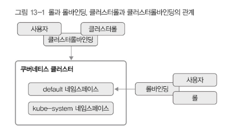

# 13. 인증과 권한 관리

kute-apiserver는 사용하려면 TLS 인증이 필요함.(https)  
kubectl 명령어가 작동하는 이유는 설정에 이미 TLS인증 정보가 포함되었기 때문임.  

- 사용자 계정: 구글 계정, 키스톤, LDAP등 별도의 외부 인증 시스템 사용  
- 서비스 계정: 쿠버네티스가 직접 관리하는 사용자 계정 (시크릿을 비밀번호로 사용)

## 권한관리

- ABAC: 속성 기반 권한 관리, 속성으로는 user, group, request path, request verb등이 있음 (거의 사용 X)
- RBAC: 역할 기반 권한 관리

RBAC로 설명하면 아래와 같다.

## 롤

특정 API나 자원 사용 권한을 명시해둔 규칙 집합

- 일반 롤: 해당 롤이 속한 네임스페이스에만 적용됨 (네임스페이스에 한정되지 않은 자원과 API의 사용권한 설정 가능)
- 클러스터 롤: 네임스페이스를 벗어난 클러스터 전체 사용 권한을 관리 (레이블 셀렉터로 자원을 선택함)

## 롤바인딩

- 롤 바인딩: 롤과 사용자를 묶는 역할; 사용자가 어떤 롤을 사용하는지 설정
- 클러스터롤 바인딩: 클러스터 롤과 사용자를 묶음

