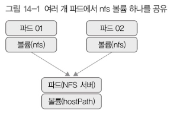
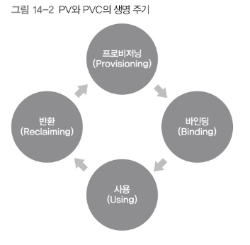

# 14. 데이터 저장

## 볼륨

컨테이너는 기본적으로 stateless 앱 컨테이너라서 데이터를 저장하지 않는다.  
Mysql과 같은 컨테이너는 종료했을때 데이터가 사라지면 안된다.  

이런상황에서 볼륨을 사용한다.

<details>
<summary>쿠버네티스에서 사용할 수 있는 볼륨 플러그인</summary>
<div markdown="1">

*aws, azure, gce로 시작하는 볼륨은 클라우드 서비스에서 제공하는 볼륨 서비스임

- awsElasticBlockStore
- azureDisk
- azureFile
- cephfs
- configMap
- csi
- downwardAPI
- emptvDir
- effiber channel
- flocker
- hostPath
- iscsi
- local
- nfs
- persistent VolumeClaim
- projected
- portworx Volume
- quobyte
- rbd
- scalelO
- gcePersistentDisk
- secret
- gitRepo (deprecated)
- glusterfs
- storageos
- vsphereVolume

</div>
</details>

## emptyDir
emptyDir은 **파드**가 실행되는 호스트의 디스크를 임시로 볼륨으로 할당해서 사용하는 방법.  
파드가 사라지면 볼륨도 같이 사라진다.  
주로 중간 저장용으로 사용하곤 한다.

아래와 같이 적용한다.
```yaml
volumes:
- name: emptydir-vol
  emptyDir: {}
```

## hostPath
파드가 실행된 호스트의 파일이나 디렉터리를 파드에 마운트한다.  
호스트에 실제있는 파일을 마운트하는 개념.  
파드가 죽어도 데이터는 살아있다.

아래와 같이 적용한다
```yaml
volumes:
- name: hostpath-vol 
  hostPath:
    path: /tmp
    type: Directory
```

## nfs
기존에 사용하는 NFS서버를 이용해 파드에 마운트한다.  

파드 하나에 안정성이 높은 외부 스토리지를 볼륨으로 설정한 후, 그 파드에 NFS서버를 설정한다.  
그 후, 다른 파드들이 이 서버를 nfs볼륨으로 마운트 하는 구조다.  


## PersistentVolume, PersistentVolumeClaim

PV(PersistentVolume)는 볼륨 자체를 뜻하고 클러스터 안에서 자원으로 다룬다.  
PVC(PersistentVolumeClaim)는 사용자가 PV에 하는 요청이다.  

쿠버네티스는 볼륨을 파드에 직접 할당하지 않고 중간에 PVC를 두어 파드와 파드가 사용할 저장소를 분리한다.

## PV와 PVC의 생명주기



1. 프로비저닝: PV를 만드는 단계

    - 정적: 미리 PV를 만들어 두고 할당  
    - 동적: 사용자가 PVC를 거쳐서 PV를 요청했을때 생성, 제공

2. 바인딩: 프로비저닝으로 만든 PV를 PVC와 연결하는 단계

    - PV와 PVC매핑은 1대 1관계

3. 사용: PVC는 파드에 설정된 후, 파드는 PVC를 볼륨으로 인식해 사용함

4. 반환: 사용이 끝난 PVC는 삭제되고 PV를 초기화 하는 과정을 거침

    - Retrain: PV를 그대로 보존
    - Delete: PV를 삭제하고 연결된 볼륨도 삭제
    - Recycle: PV의 데이터를 삭제하고 새로운 PVC에서 해당 PV를 사용하게 함

PV는 자원이고 PVC는 해당 자원을 사용하겠다고 하는 것이므로 파드와 서비스를 연결하는 것 처럼 레이블을 사용해 연결할 수 있다.

파드에서 PVC를 사용하려면 다음과 같이 하면 되겠다.
```yaml
volumes:
- name: myvolume 
  persistentVolumeClaim:
    claimName: pvc-hostpath # 사용할 PVC
```