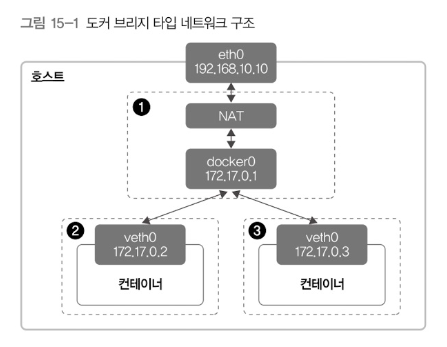
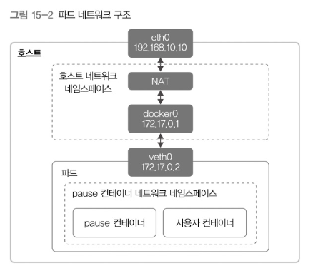
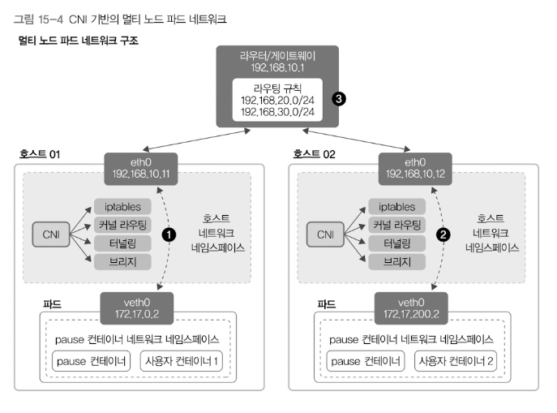
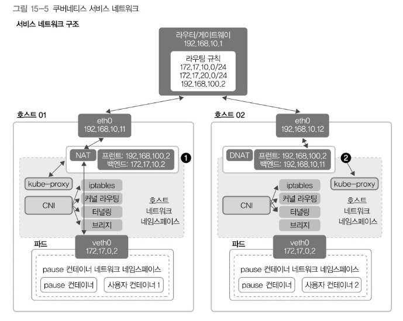

# 15. 클러스터 네트워킹 구성

## 도커 컨테이너의 네트워킹

일반적인 도커 브리지 타입 네트워크 구조

도커 브리지 타입 네트워크는 호스트 안에 `docker0`라는 브리지를 추가해 컨테이너와 호스트 사이를 연결함

점선으로 표시된 부분은 네트워크 네임스페이스임. (네트워크 네임스페이스는 별도의 ARP, 라우팅, iptables가 있음)

1번 부분은 호스트 네트워크 네임스페이스로, 호스트의 기본 네트워크가 생성되고 관리되는 곳이다.  
2번, 3번 부분은 컨테이너 네트워크 네임스페이스로, 컨테이너를 생성할때마다 생성되고 별도의 네트워크를 사용하게 합니다.

각 네트워크 네임스페이스는 veth라는 가상장치로 연결한다.  
한쪽은 컨테이너, 다른 한쪽은 호스트의 브리지에 연결해서 호스트와 컨테이너 네트워크 사이를 통신한다.  

브리지 이외에도 여러 타입이 있음

- 브리지 타입: 기본타입, 컨테이너와 호스트가 veth를 이용해 연결함
- 오버레이 타입: 여러 대 호스트가 있을 때 각 호스트에 있는 컨테이너 네트워크를 오버레이 네트워크(VXLAN)로 연결시킨다. 도커 스웜의 기본 네트워크라고 함.
- 맥브이랜 타입: 이너넷 장치 하나에서 여러개의 가장 MAC주소를 할당하는 기술 (브리지보다 10~20% 빠름)
- 호스트 타입: 호스트의 네트워크 네임스페이스를 직접 사용함.
- 링크 타입: 컨테이너별로 새로운 네임스페이스를 만들지 않고 이미 준비된 네임스페이스에 연결해 사용함 (쿠버네티스 파드 네트워크의 기본)

## 파드의 네트워킹

쿠버네티스는 도커와 달리 파드 단위로 컨테이너를 관리함.  

"파드는 쿠버네티스에서 생성한 pause라는 컨테이너 그룹을 말한다."  
그래서 파드에 속한 컨테이너들은 같은 IP를 갖게 된다.  

노드가 여러개일때는 아래와 같은 방식을 쓴다.  
다른 노드의 파드는 다른 네트워크 환경에 있기 때문에, 아이피가 같아질 수 있는 문제가 있는데, 이점을 CNI가 해결해준다고 보면 되겠다.  

실제 서비스에선 보통 여러 개의 파드들 앞에 서비스를 두고 사용한다.  
그래서 실제로는 파드의 ip대신 서비스의 ip를 사용하게 된다. 아래처럼.  

