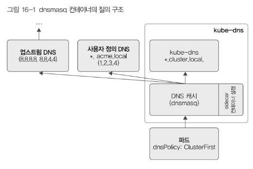

# 쿠버네티스 DNS

쿠버네티스에서는 클러스터 안에서만 사용하는 DNS를 설정할 수 있다.  
그러니까 파드 사이에 통신을 IP가 아닌 도메인으로 할 수 있다는 소리!

## 클러스터 안에서 도메인 사용

쿠버네티스의 특정 서비스에 접근하는 도메인: `서비스.네임스페이스.svc.cluster.local`  
호스트네임과 서브도메인 이름을 설정한다면: `호스트.서브도메인.네임스페이스.svc.cluster.local`  

예를 들어 파드에 스펙을 다음과 같이 명시하면, appname.default-subdomain.default.svc.cluster.local로 접근할 수 있게된다.
```yaml
spec: 
  hostname: appname
  subdomain: default-subdomain
  containers: ...
```

## DNS 질의 구조

DNS는 클러스터 안에서 파드로 실행하는 것이므로 도메인 이름을 어떤 순서로 질의할지 정할 수 있다.

.spec.dnsPolicy 필드를 통해 정할 수 있다고 함.

- Default: 파드는 자신의 노드의 DNS 설정을 그대로 사용한다. 
- ClusterFirst: 클러스터 도메인 형식과 일치하지 않는 www.example.com을 사용할 수 있게 함 (외부 DNS인 업스트림 DNS에 도메인 이름을 질의함)
- ClusterFirstWithHostNet: 파드를 호스트 모드로 사용
- None: DNS 설정 무시

## kube-dns의 질의구조

kube-dns 파드는 kubedns, dnsmasq, sidecar라는 컨테이너가 3개 있다.

kubedns: 쿠버네티스 마스터를 바라보다가 변경사항이 있으면 DNS데이터를 변경함

sidecar: kubedns와 dnsmasq 컨테이너에 헬스 체크 담당

dnsmasq: 컨테이너는 아래와 같은 질의 구조로 동작한다.

  - kube-dns파드에 도메인 이름을 질의했을 때 원하는 결과를 못 찾으면 사용자 정의 DNS에 질의한다.
  - 그런데도 없으면 업스트림 DNS에 질의함

