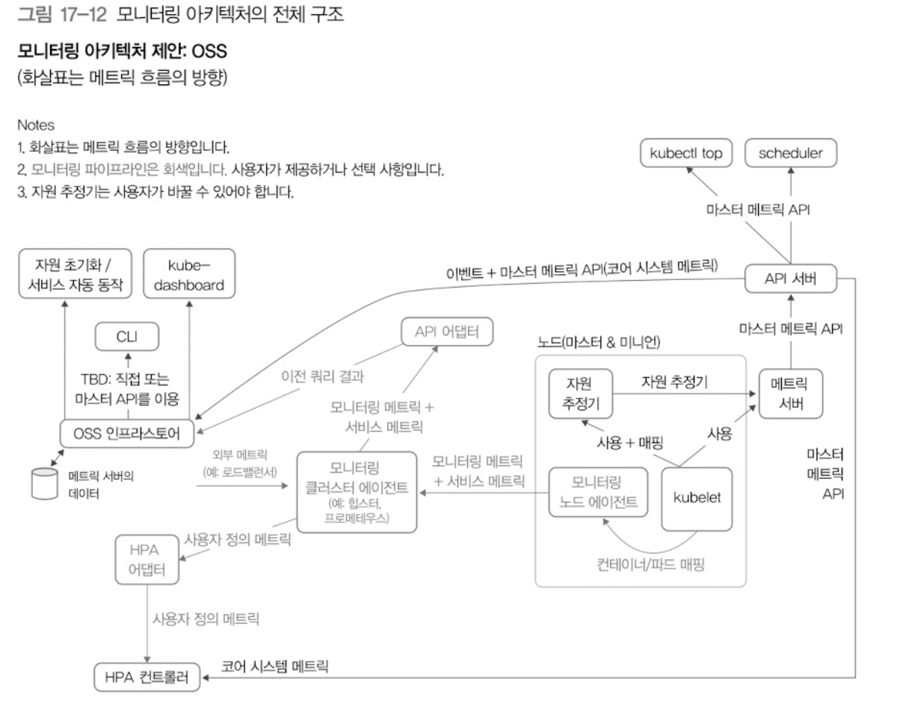
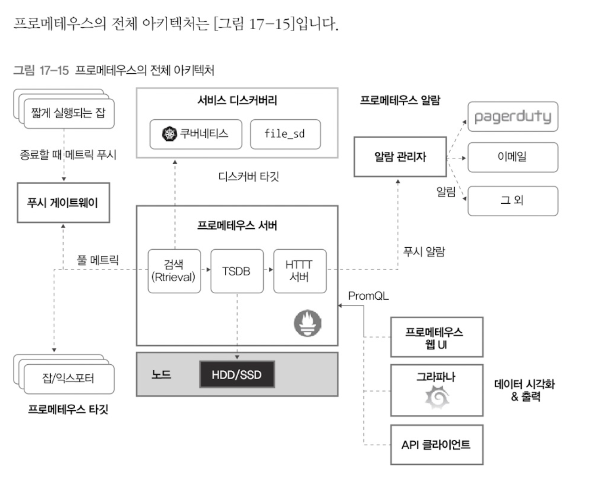

# 로깅

쿠버네티스와 같은 환경에서는 로그를 다루기가 좀 까다롭다.  
일반적으로는 로컬에 저장하곤 하는데, 컨테이너가 클러스터 안 여러 노드를 옮겨 다니기 때문이다.  

쿠터네티스의 kubectl은 개별 노드에 접근하지 않고 직접 파드의 로그를 확인할 수 있다.
```
kubectl logs -f 파드이름
```

## 일레스틱서치 사용
로그들을 한번에 모아서 살펴보도록 일레스틱서치와 같은 도구를 사용할 수 있다.

일레스틱서치 서버를 디플로이먼트로 설정하려면 elastic 이미지를 받은 뒤,   
환경변수에 설정값을 넣어주면 된다.
```yaml
... 디플로이먼트
containers:
- name: elasticsearch
  image: elastic/elasticsearch:6.4.0
  env:
  - name: discovery.type
      value: "single-node"
  ports:
  - containerPort: 9200

... 다음은 서비스
spec:
  ports:
  - name: elasticsearch-rest 
    nodePort: 30920
    port: 9200
    protocol: TCP
    targetPort: 9200
  selector:
    app: elasticsearch
```

## 키바나 사용
일레스틱서치만 사용하면 로그 데이터를 시각적으로 보기는 어렵다.  
그래서 키바나를 쓴다고 한다.

키바나 디플로이먼트는 다음과 같이 설정한다.  
이때 일레스틱서치를 찾는 도메인을 환경변수에 지정해주었다.
```yaml
...디플로이먼트
spec: 
  containers:
  - name: kibana
  image: elastic/kibana:6.4.0
  env:
  - name: SERVER_NAME
    value: "kibana.kubenetes.example.com"
  - name: ELASTICSEARCH_URL
    value: "http://elasticsearch-svc.default.svc.cluster.local:9200"
  ports:
  - containerPort: 5601
```

## 클러스터 레벨 로킹
- 생명주기와 분리된 스토리지를 구축하는 아키텍처

- 컨테이너 로그
  - 컨테이너 런타임(보통 도커)이 담당
  - 도커는 다양한 로그 드라이버 지원 (기본 json-file)

- 시스템 컴포넌트 로그
  - 쿠버네티스의 시스템 구성 오소 중 일부(kubelet, docker)는 컨테이너 기반으로 동작하지 않음
  - systemd는 systemd-journald로 로그를 관리

## 스턴을 이용한 실시간 로그 모니터링
- shell에서 바로 여러 개 파드의 로그를 실시간으로 볼 수 있음.
- `stern kube -n kube-system`명령으로 로그 확인

## 쿠버네티스 대시보드
- 웹 UI기반 대시보드

## 쿠버네티스 모니터링 아키텍처
- 시스템 메트릭
  - 노드나 컨테이너의 CPU, 메모리 사용량 같은 시스템 관련 메트릭
    - 코어 메트릭과 비코어 메트릭으로 나뉨

- 서비스 메트릭
  - 애플리케이션 모니터링
  - 인프라용 컨테이너에서 수집하는 메트릭
  - 애플리케이션에서 수집하는 메트릭
    - 웹 서버의 응답시간 관련값이나 HTTP 500에러같은 서비스 정보 파악

- 코어 메트릭 파이프라인
  - 핵심 요소의 모니터링
  - kubelet, 메트릭 서버, 메트릭 API로 구성

- 모니터링 파이프라인
  - 여러가지 메트릭 수집(기본 메트릭 포함)
  - 외부 모니터링 도구를 조합해서 사용

- 모니터링 아키텍쳐의 전체구조


## 힙스터
- 클러스터나 앱 컨테이너 모니터링
- 쿠버네티스에서 권장하지 않는 방식

## 프로메테우스
- 시계열 데이터를 저장할 수 있는 다차원 데이터 모델을 활용할 수 있는 PromQL 쿼리 언어 지원
- 프로메테우스 아키텍쳐

  - 프로메테우스 서버: 시계열 데이터를 수집해서 저장
  - 클라이언트 라이브러리: 애플리케이션을 개발할때 데이터를수집하도록 만드는 라이브러리
  - 클라이언트에서 프로메테우스로 데이터를 보낼때 받는 역할
  - 익스포터: 프로메테우스 클라이언트 라이브러리를 내장해 만들지 않는 애플리케이션에서 데이터 수집
  - 알람을 보낼 때 중복처리 그룹화를 해서 알람을 어디로 보낼지 관리
  
