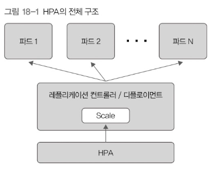

# 오토스케일링

HPA라는 것이 디플로이먼트를 이용해 CPU사용률 기반으로 파드 개수를 늘리거나 줄여준다.  

HPA는 컨트롤러 매니저 안에서 주기적으로 실행하면서 설정된 HPA의 상태를 확인한다.  

디플로이먼트에 속한 파드들의 상태를 모니터링하다가 특정 조건에 이르면 파드 개수를 늘리거나 줄인다.  
기준은 대충 다음 식과 같다.

**대상 파드 개수 = ceil(현재 파드의 CPU 사용률을 모두 더한 값 / 목표 CPU 사용률)**

대상 파드 개수를 목표로 파드 수를 조정한다.  