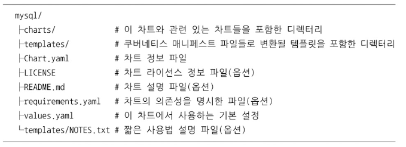

# 헬름
- 템플릿 파일들의 집합(차트)을 관리하는 쿠버네티스 패키지 매니저 도구
- 차트 저장소와 연결해 클러스터에서 차트 설치, 삭제 가능
- 차트들로 필요한 애플리케이션들을 빠르게 설치할 수 있음.  
    -  Mysql, Redis, Jenkins, Hadoop 등 많은 애플리케이션을 쉽게 설치할 수 있는 차트가 준비되어있다.

## 세가지 주요 개념
- 차트(chart): 쿠버네티스에서 실행할 애플리케이션을 만드는 데 필요한 정보 묶음
- 컨피그(config): 패키징한 차드에 넣어서 배포 가능한  오브렉트 만들때 사용
- 릴리즈(release): 특정 컨피그를 이용해 실행중인 차트의 인스턴스

## 헬름 클라이언트와 틸러 서버
- 헬름 클라이언트: 커맨드라인 인터페이스
    - 로컬서버에서 차트 생성, 차트 저장소 관리
    - 틸러 서버에 클러스터에 설치하려는 차트를 보낼 수 있다.
    - 틸러 서버에 정보를 요청, 업그레이드, 삭제 요청을 보냄
- 틸러 서버: 클러스터 안에서 헬름 클라이언트의 명령을 받아 쿠버네티스 API와 통신
    - gRPC이용해 통신
    - 헬름 클라이언트의 요청을 처리

## 헬름 차트의 구조
차트는 디렉처리 하나에 포함된 파일들의 집합이다.  
대략 아래와 같은 구조이다.

