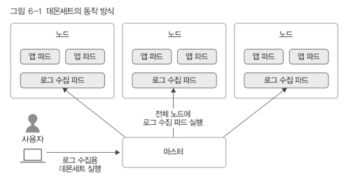

# 6. 컨트롤러
컨트롤러는 파드들을 관리하는 역할을 한다.

## 레플리케이션 컨트롤러
지정된 숫자만큼의 파드를 실행함.  
지정된 숫자보다 적은 경우, 파드를 다시 실행함.
지정된 숫자보다 큰 경우, 파드를 종료함

- 책에서는 레플리카세트가 있어서 요즘은 안쓴다고함.

## 레플리카 세트 replicaset
레플리케이션 컨트롤러의 업그레이드 버전

- set based selector를 지원: 셀렉터에 in, notin, exists같은 연산자를 쓸 수 있다.

레플리카세트는 아래와 같이 템플릿을 만들어 사용 수 있다.
```yaml
apiVersion: apps/v1
kind: ReplicaSet
metadata:
  name: nginx-replicaset
spec:
  template: # 실행할 파드를 여기 아래에 적으면 된다.
    metadata:
      name: nginx-replicaset #실행할 파드 이름
      labels: #오브젝트를 식별하는 식별자
        app: nginx-replicaset #앱 컨테이너고 nginx-replicaset로 설정
    spec:
      containers: # 컨테이너의 구체적인 명세
      - name: nginx-replicaset
        image: nginx
        ports:
        - containerPort: 80
  replicas: 3 # 실행할 파드의 수 (기본은 1)
  selecter: # 어떤 레이블의 파드를 선택해서 관리할지 설정
    matchLabels:
      app: nginx-replicaset
```

실행 명령어는 아래와 같다.
```bash
> kubectl apply -f replicaset-nginx.yaml
```
삭제하려면 다음과 같이 하면 된다. (파드와 레플리카세트가 같이 삭제된다)
```bash
> kubectl delete replicaset [컨테이너 이름]
```

근데, 레플리카 세트만 삭제하고 싶을때는?  
`--cascade=false`옵션을 적용하면 된다.
```bash
> kubectl delete replicaset [컨테이너 이름] --cascade=false
```
이 파드들은 이제 관리할 수 없는 걸까?  
다시 이 파드들을 관리하고 싶으면 레플리카셋을 생성하면 된다!  

레이블로 파드를 선택하기 때문에 그런게 아닐까 싶다. (뇌피셜)  
-> 실행중인 파드의 labels을 바꾸면 레플리카셋에서 분리해 사용할 수 있다.

## 디플로이먼트 Deployment
디플로이먼트는 stateless 앱을 배포할때 가장 기본적인 컨트롤러라고 한다.  
기본적인 앱 배포시 요놈을 쓰면 된다는 듯!  

디플로이먼트는 레플리카셋을 관리한다. 배포기능을 세분화 해서 관리할 수 있다고 함.  

아래는 디플로이먼트 템플릿이다. 레플리카셋과 비교해서 바뀐건 kind밖에 없다.
```yaml
apiVersion: apps/v1
kind: Deployment
metadata:
  name: nginx-deployment
  labels:
    app: nginx-deployment
spec:
  replicas: 3 # 실행할 파드의 수 (레플리카셋이랑 똑같다.)
  selecter: # 어떤 레이블의 파드를 선택해서 관리할지 설정
    matchLabels:
      app: nginx-deployment

  template: # 실행할 파드를 여기 아래에 적으면 된다.
    metadata:
      name: nginx-deployment #실행할 파드 이름
      labels: #오브젝트를 식별하는 식별자
        app: nginx-deployment #앱 컨테이너고 nginx-deployment로 설정
    spec:
      containers: # 컨테이너의 구체적인 명세
      - name: nginx-deployment
        image: nginx
        ports:
        - containerPort: 80
```

실행방법은 `kubectl apply -f [yaml파일]` 명령을 보내면 된다.    

디플로이먼트를 보려면 아래와 같이 하면 된다.
```bash
> kubectl get deploy
NAME               READY   UP-TO-DATE   AVAILABLE   AGE
nginx-deployment   3/3     3            3           6s
```

디플로이먼트를 실행하면 이 친구가 관리하는 레플리카셋도 같이 생성된다.
```bash
> kubectl get rs
NAME                          DESIRED   CURRENT   READY   AGE
nginx-deployment-6ffb7f48cb   3         3         3       38s
> kubectl get pods
NAME                                READY   STATUS    RESTARTS   AGE
nginx-deployment-6ffb7f48cb-5htlz   1/1     Running   0          64s
nginx-deployment-6ffb7f48cb-lmrp2   1/1     Running   0          64s
nginx-deployment-6ffb7f48cb-rbp8l   1/1     Running   0          64s
```

디플로이먼트가 관리하는 컨테이너를 수정하는 등, 디플로이먼트의 설정을 바꾸게 된다면 재실행되어 새로운 레플리카셋이 생성된다고 한다.

이외에도 다양한 기능이 있다. (내용 압박으로 다 적지 못함)

- 롤백: `kubectl rollout undo deploy`
- 파드개수 조절: `kubectl scale deploy [deploy이름] --replicas=5`
- 배포 정지: `kubectl rollout pause deployment/[이름]`
- 배포 재개: `kubectl rollout resume deployment/[이름]`
- 재시작: `kubectl rollout restart deployment/[이름]`

## 데몬세트 Daemonset
데몬세트는 클러스터 전체 노드에 특정 파드를 실행할때 사용하는 컨트롤러다.  
새로운 노드가 추가되었을때 해당 노드에 파드를 실행시키고, 노드가 사라지면 파드도 같이 사라진다.


위 그림과 같이 보통 로그 수집기를 실행하거나 노드를 모니터링 하는 용도로 실행하는 듯. (항상 실행해야 하는 파드에 사용)

## 스테이트풀세트 Statefulset
스테이트풀세트는 상태가 있는 파드들을 관리하는 컨트롤러다.  
데이터는 볼륨을 사용해서 저장한다고함.

템플릿은 아래와 같은데, 서비스에 종속되는 듯?

```yaml
apiVersion: apps/v1
kind: StatefulSet
metadata:
  name: web
spec:
  selecter:
    matchLabels:
      app: nginx-statefulset
  serviceName: "서비스 이름"
  replicas: 3

  template: 
    metadata:
      ...
    spec:
      containers: 
      - name: nginx-deployment
        image: nginx
        ports:
        - containerPort: 80
```

3개의 파드는 동시에 생성되지 않고 하나씩 실행된다.  
파드 이름도 단순한 UUID가 아니라 0, 1, 2 이런식으로 순서가 들어간다.  
(병렬로 하고 싶으면 spec에 `podManagermentPolicy: Parallel`옵션을 넣어주면 된다.)

## 잡
실행된 후 종료해야 하는 성격의 작업을 실행시킬 때 사용하는 컨트롤러 (?)  

job은 단일 job, 완료된 job 개수가 있는 parallel job, 워크 큐를 가지는 parallel job이 있다.

-> 음... 언제 쓰는거지?