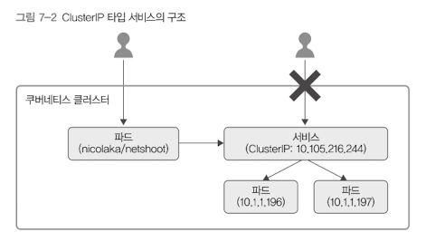

# 7. 서비스

컨트롤러가 관리하는 파드는 고정되지 않고 클러스터 안을 옮겨다닌다.  
때문에 파드의 IP가 변하기도 하는데, 이렇게 동적으로 변하는 파드들에 고정적으로 접근할 때 사용하는 방법이 서비스이다.

대략, 아리와 같이 서비스는 파드가 변해도 알아차릴 수 있어야 한다.

## 서비스 타입

- ClusterIP: 기본 서비스 타입, 클러스터 안에서만 사용할 수 있음
- NodePort: 서비스 하나에 모든 노드의 지정된 포트 할당. 
- LoadBalancer: 로드밸런서 장비에 사용됨
- ExternalName:  서비스를 .spec.externalName 필드에 설정한 값과 연결, (클러스터 안에서 외부에 접근할때 사용)

### ClusterIP
아래는 책에 등장한 ClusterIP 타입 서비스의 전체 구조이다.  
그림의 서비스의 cluster ip는 클러스터 안에서만 접근이 가능하다.  
(우리는 다른 파드를 통해서 접근해야 함)  

### NodePort
고정 포트로 각 노드의 ip에 서비스를 노출시킴.  
클러스터 외부에서 서비스를 해당 포트를 통해 적솝할 수 있다.  

### LoadBalancer
클라우드 제공자의 로드 벨런서를 사용해서 서비스를 외부에 노출시킴.  
(자동으로 해준다는 듯)

### ExternalName
CNAME레코드를 리턴해서 서비스를 필드의 콘텐츠에 매핑한다? (이해못함)

-----

## 헤드리스 서비스
ClusterIP이지만, ip를 None으로 설정한 서비스.  
로드밸런싱이 필요 없거나 단일 서비스 IP가 필요 없을때 사용

## kube-proxy
클러스터 ip나 nodePort로 접근할 수 있게 만드는 컴포넌트  

### userspace 모드
클러스터 IP를 통해 어떤 요청을 하면 iptable을 거쳐서 kube-proxy가 요청을 받음.  
그리고 요청을 파드들에게 라운드 로빈으로 나눠주는 방식  
파드 하나로의 연결 요청이 실패하면 재시도 하지 않고 그냥 요청이 실패함.

### iptables 모드
kube-proxy가 iptables을 관리하는 역할만 수행함.  
때문에 성능이 userspace보다 좋다.  

### IPVS 모드
리눅스 커널에 있는 L4로드밸런싱 기술인 넷필터를 사용한 방식.  
커널의 힘을 빌리기 때문에 iptables보다 좋은 성능을 낸다.  
