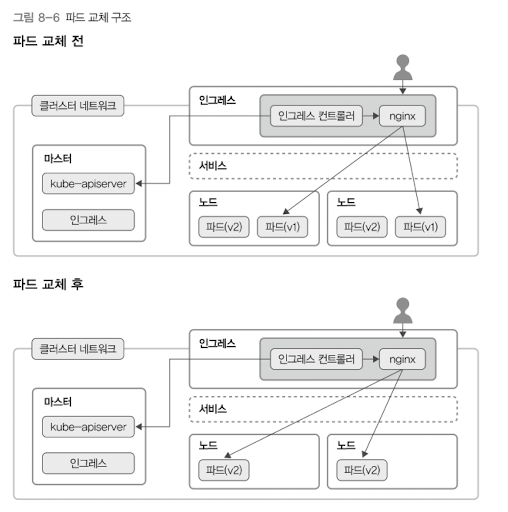

# 8. 인그레스

클러스터 외부에서 안으로 접근하는 요청들을 어떻게 처리할지 정의해둔 규칙 모음.  
인그레스 자체는 여러 규칙들을 정의해둔 자원이다.  
인그레스 컨트롤러가 실제로 동작시킨다고 함.  

```yaml
sepc:
    rule:
    - host: foo.bar.com
      http: 
        paths:
        - path: /a # foo.bar.com/a는 서비스 s1의 80포트로 보내줘
          backend:
            serviceName: s1 
            servicePort: 80
        - path: /b # foo.bar.com/b는 서비스 s2의 80포트로 보내줘
          backend:
            serviceName: s2
            servicePort: 80
```

### 인그레스 컨트롤러
인그레스 자체는 설정이고, 아무 기능을 하지 못한다.  
인그레스 컨트롤러가 있어야 한다.  

nginx용 ingress-nginx 컨트롤러가 있다. (niginx를 로드벨런서로 사용)

### 무중단 배포 rolling update strategy

*핵심이 이 필드인것 같아서 이것만 준비했습니다*

무중단 배포시 사용하는 rolling update strategy는 아래와 같은 방식으로 이루어진다.  
새로운 파드를 띄우고 헬스 체크를 한 뒤, 트래픽을 새로운 파드쪽으로 옮기는 방식이다.  



```yaml
apiVersion: apps/v1
kind: Deployment
metadata:
  name: nginx-deployment
spec:
  selecter:
    matchLabels:
      app: nginx-deployment
  strategy:
    type: RollingUpdate
    rollingUpdate:
      maxSurge: 25% # rolling update 중 새로운 pod를 만들 수 있는 최대 개수
      maxUnavailable: 25% # rolling update 중 unavailable 상태인 Pod
  template: 
    metadata:
      name: nginx-deployment 
      labels: 
        app: nginx-deployment 
    spec:
      containers: # 컨테이너의 구체적인 명세
      - name: nginx-deployment
        image: nginx
        ports:
        - containerPort: 80
        livenessProbe: # livenessProve를 설정해줘서 컨테이너 상태를 확인한다.
          httpGet:
            path: /liveness
            port: 5000
        readinessProbe: # readinessProve를 설정해서 컨테이너가 서비스 요청을 받을 준비가 되어있는지 확인한다.
          httpGet:
            path: /readiness
            port: 5000
```