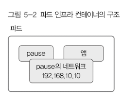
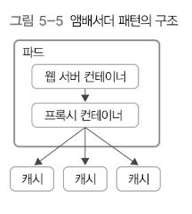
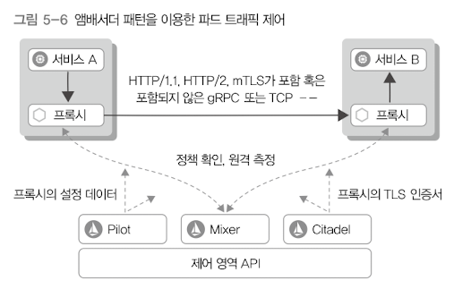

# 5. 파드 
## 1) 개념
- 쿠버네티스는 컨테이너를 "파드"라는 단위로 묶어서 관리함 
  - 즉, 여러 개의 컨테이너로 구성됨 
- 파드에 속한 컨테이너들은 모두 노드 하나 안에서 실행됨 
  - 컨테이너들이 같은 목적으로 자원을 공유함 
  - 컨테이너마다 역할 부여 가능 
    - ex: 로그 수집기 컨테이너, 웹 서버 컨테이너, 볼륨 컨테이너 ...
  - 파드 하나 안의 컨테이너들은 IP 하나를 공유함
  - 외부 → 파드의 IP에 접근 → 파드 안 컨테이너와는 포트를 통해 통신 


## 2) 파드 생명주기
### 생명주기
- Pending: 파드를 생성하는 중 
- Running: 파드 안의 모든 컨테이너가 실행 중
- Succeeded: 파드 안 모든 컨테이너가 정상 실행 종료된 상태로 재시작되지 않음
- Failed: 파드 안 모든 컨테이너 중 정상적으로 실행 종료되지 않은 컨테이너가 있는 상태 
  - 컨테이너 종료 코드 != 0 인 경우, 비정상 종료거나 시스템이 컨테이너를 종료한 것 (OOM → 종료코드 137)
- Unknown: 파드의 상태를 확인할 수 없는 상태. 파드가 있는 노드와 통신할 수 없는 경우.


### 상태
- `kubectl describe pods {pod 이름}`을 입력하면 정보가 나옴
- Type
  - Initialized: 모든 초기화 컨테이너가 성공적으로 시작 완료됨
  - Ready: 파드는 요청들을 실행할 수 있고, 연결된 모든 서비스의 로드밸런싱 풀에 추가되어야 한다는 뜻
  - ContainersReady: 파드 안 모든 컨테이너가 준비 상태라는 뜻
  - PodScheduled: 파드가 하나의 노드로 스케줄을 완료했다는 뜻 
  - Unschedulable: 스케줄러가 자원의 부족이나 다른 제약 등으로 지금 당장 파드를 스케줄할 수 없음 
- Status
  - Type의 상태 활성화 여부를 나타냄
  - True, False, Unknown

---

## 3) kubelet으로 컨테이너 진단하기 
- 컨테이너가 실행된 후에는 kubelet이 컨테이너를 주기적으로 전달함
- livenessProbe: 컨테이너가 실행됐는지 확인 
  - 실패 → 컨테이너 종료 → 컨테이너 재시작
- readinessProbe: 컨테이너 실행 후 서비스 요청에 응답할 수 있는지를 진단
  - 엔드포인트 컨트롤러는 해당 파드에 연결된 모든 서비스를 대상으로 엔드포인트 정보를 제거 
  - 실제 트래픽을 받을 준비가 되었음을 확인한 후 트래픽을 받을 수 있음 

### 컨테이너 진단
- 컨테이너가 구현한 핸들러를 kubelet이 호출하여 실행
- 핸들러
  - ExecAction: 컨테이너 내부의 지정된 명령을 실행 → 종료 코드가 0일 때 Success 진단
  - TCPSocketAction: 컨테이너 안에 지정된 IP와 포트로 TCP 상태 확인 → 포트가 열려 있을 시 Success 진단
  - HTTPGetAction: 컨테이너 안에 지정된 IP, 포트, 경로로 HTTP GET 요청을 보냄 → 응답 상태 코드가 200~400이면 Success 진단
- 진단 결과
  - Success, Failure, Unknown

---

## 4) 초기화 컨테이너
- 초기화 컨테이너는 앱 컨테이너가 실행되기 전에 파드를 초기화함 
- 보안상의 이유로 앱 컨테이너 이미지와 같이 두면 안 되는 앱의 소스 코드를 별도로 관리할 때 유용 

### 특징 
- 초기화 컨테이너는 여러개를 구성할 수 있음
  - 여러 개 있을 경우, 파드 템플릿에 명시한 순서대로 초기화 컨테이너 실행
- 초기화 컨테이너 실행이 실패하면, 성공할 때까지 재시작함 
  - 쿠버네티스의 "선언적" 특징에서 벗어날 수 있음 → 필요한 명령들을 순서대로 실행하는 데 사용 
- 초기화 컨테이너가 모두 실행된 후에야 앱 컨테이너가 실행 됨 
  - 즉, 파드를 실행할 때 앱 컨테이너가 외부의 특정 조건을 만족할 때까지 대기하고 있다가 조건이 충족된 후 앱 컨테이너를 실행함 
- 이는 파드가 모두 준비되기 전에 실행한 후 종료되는 컨테이너임 
  - `readinessProbe`를 지원하지 않음 


---

## 5) 파드 인프라 컨테이너

- 모든 파드에서 항상 실행되는 `pause`라는 컨테이너가 있는데, 이를 파드 인프라 컨테이너라고 함 
- `pause`는 파드 안 기본 네트워크로 실행됨 
- PID=1, 다른 컨테이너의 부모 컨테이너 역할 
- 파드 안 다른 컨테이너는 `pause` 컨테이너가 제공하는 네트워크를 공유해서 사용


---

## 6) 스태틱 파드
- `kube-apiserver`를 통하지 않고 `kubelet`이 직접 실행하는 파드들을 의미 
- `kubelet`이 직접 관리
  - 이상이 생기면 재시작 
  - `kubelet`이 실행중인 노드에서만 실행됨 → 다른 노드에서는 실행 X
  - `kube-apiserver`로 파드를 조회할 수는 있으나 실행 할수는 없음 

### 사용 용도
- `kube-apiserver`, `etcd`같은 시스템 파드를 실행하는 용도로 많이 사용 
  - `kube-apiserver` 자체를 처음 실행하는 별도의 수단으로써 스태틱 파드를 이용함

---

## 7) 파드에 CPU와 메모리 자원 할당 
- 노드 하나에 여러 개의 파드를 실행하는 경우 
  - 자원 사용량이 많은 파드가 노드 하나에 모여있다면 파드들의 성능이 나빠짐 
  - 전체 클러스터의 자원 사용 효율도 낮아짐 
  - 어떤 노드는 자원이 남고, 어떤 노드는 자원이 부족한 현상이...

### 쿠버네티스가 위 상황을 막는 방법
- 파드를 설정할 때 파드 안 각 컨테이너가 CPU, 메모리를 얼마나 사용할 수 있을지, pod 관련 yml 설정 파일에 조건을 지정
  - `.spec.containers[].resources.requests` : 최소 자원 요구량
    - 해당 필드에 설정된 만큼의 자원 여유가 있는 노드가 있어야 파드를 그곳에 스케줄링해서 실행함
    - 해당하는 노드가 없다면 파드는 Pending 상태로 실행되지 않음 
    - 클러스터 내에 자원적인 여유가 생길 때까지 대기 
  - `.spec.containers[].resources.limits` : 최대로 사용할 자원의 양
    - 모든 노드의 자원을 사용 해버리는 것을 방지 
  - 쿠버네티스가 파드를 스케줄링할 때
    - 노드의 현재 사용량을 보지 않고, 위 언급된 두 필드만을 확인
    - ex: 메모리가 4GB인 노드에 `requests.memory=2GB`인 파드를 설정 → 하지만 해당 파드가 3GB의 메모리를 사용했다고 가정
    - `requests.memory=1.5GB`인 파드를 추가로 설정 → 쿠버네티스는 `4GB - 2GB`를 계산하여 2GB가 여유가 있다고 생각함. (현재 3GB가 사용되고 있는지는 모름) → 추가로 파드 실행 → OOM 발생
    - 이를 막기 위해서는 `limits.memory` 필드값을 설정해야 함 (이를 설정하지 않으면 노드의 자원을 최대로 많이 사용할 수 있다는 장점은 있음)

### 단위
- 메모리 : KB, MB, GB .... 
- CPU : 1, 2, 3... (코어 개수)
  - 하지만, 오케스트레이터 도구를 사용할 때는 소수점도 가능하다. (0.1, 0.2...)
  - 소수점의 의미
    - CPU 코어 하나의 연산 능력을 기준으로 함 
    - 1 == 코어 하나의 연산 능력을 온전히 사용할 수 있음
    - 0.1 == 코어 하나의 10% 만큼의 연산 능력을 사용할 수 있음 

---

## 8) 파드에 환경 변수 설정
- pod 설정 관련 yml 파일의 `.spec.containers[].env[]` 필드에 적용
```yaml
spec:
  env:
  - name: TEST
    value: "test"
  - name: HOST_NAME
    valueFrom:
      fieldRef:
        fieldPath: spec.nodeName
  - name: CPU_REQUEST
    valueFrom:
      resourceFieldRef:
        containerName: kubernetes-simple-pod
        resource: requests.cpu
```
- name : 환경 변수 이름
- value : 문자열이나 숫자 형식의 값을 직접 할당
- valueFrom : 값을 직접 할당하는게 아닌, 어딘가 다른 곳에서 참조하는 값을 설정
- fieldRef: 파드의 현재 설정 내용을 값으로 설정한다는 선언 
- fieldPath: fieldRef에서 어디서 값을 가져올 것인지 지정. (참조하려는 항목의 위치)
- resourceFieldRef : 컨테이너에 CPU, 메모리 사용량을 얼마나 할당했는지에 대한 정보 
- containerName : 환경 변수 설정을 가져올 컨테이너 이름
- resource : 어떤 자원의 정보를 가져올 것인가 

---

## 9) 파드 구성 패턴 
- 파드로 여러 개의 컨테이너를 묶어서 구성하고 실행할 때 몇 가지 패턴을 적용할 수 있음 
  - 컨테이너 기반의 분산 시스템 디자인 패턴(Design patterns for container-based distributed systems)
  - 단일 노드에서 여러 개 컨테이너를 구성할 때의 패턴들이 소개돼 있음 
  - 이를 참고해서 파드 안 컨테이너를 어떻게 구성할지 정할 수 있음 

### 사이드카 패턴 

- 원래 사용하려던 기본 컨테이너의 기능을 확장하거나 강화하는 용도의 컨테이너를 추가하는 것 
  - 기본 컨테이너 → 원래 목적의 기능에만 충실하도록 구성
    - 위 그림에서 웹 서버 컨테이너가 기본 컨테이너
  - 나머지 공통 부가 기능 → 사이드카 컨테이너를 추가해서 사용
    - 위 그림에서 로그 수집 컨테이너가 사이드카 컨테이너 

- 장점
  - 웹 서버 컨테이너를 다른 역할의 컨테이너로 변경했을 때도 로그 수집 컨테이너는 그대로 사용 가능 
  - 공통 역할을 하는 컨테이너의 재사용성 증대


### 앰배서더 패턴 

- 파드 안에서 프록시 역할을 하는 컨테이너를 추가하는 패턴 
- 파드 안에서 외부 서버에 접근할 때, 내부 프록시에 접근하도록 설정 → 실제 외부와의 연결은 프록시에서 처리 
- 웹 서버 컨테이너는 캐시에 localhost로만 접근 → 외부 캐시 중 어디로 접근할지는 프록시 컨테이너가 처리 


- 파드 트래픽 제어를 위와 같이 더 세밀하게 할 수 있다고 함


### 어댑터 패턴

- 파드 외부로 노출되는 정보를 표준화하는 어댑터 컨테이너를 사용한다는 뜻 
- 어댑터 컨테이너로 파드의 모니터링 지표를 표준화한 형식으로 노출시키고, 외부의 모니터링 시스템에서 해당 데이터를 주기적으로 가져가서 모니터링하는 데 이용함 
- 오픈소스 모니터링 시스템인 "프로메테우스"에서도 사용함 
