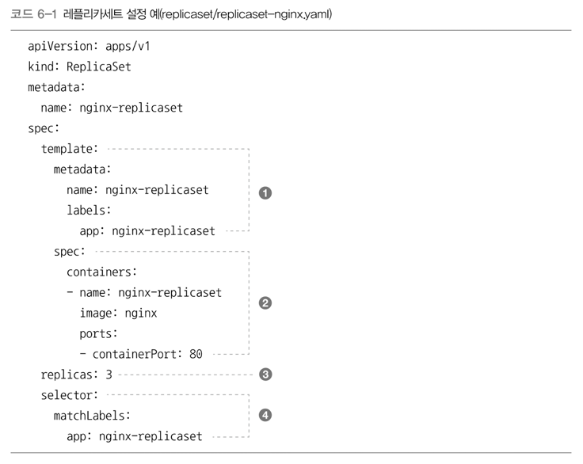
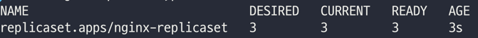
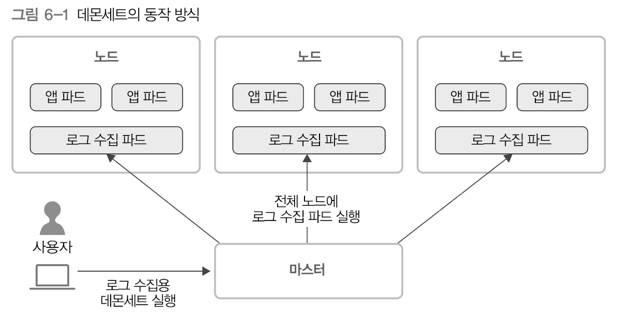

# 6. 컨트롤러 
> 파드들을 관리하는 역할

## 1) 레플리케이션 컨트롤러 
- 가장 기본적인 컨트롤러 
- 지정한 숫자만큼의 파드가 항상 클러스터 안에서 실행되도록 관리 

---

## 2) 레플리카 세트
- 레플리케이션 컨트롤러의 발전형 
- 레플리케이션 컨트롤러와 같은 동작을 함

### 차이점 
- 집합 기반의 셀렉터를 지원 
  - 레플리케이션 컨트롤러는 셀렉터가 `equality(=)` 기반이어서 레이블 선택 시 같은지 다른지만 확인
  - 집합 기반의 셀렉터는 `in`, `notin`, `exists`와 같은 연산자를 지원
- `kubectl`에서 `rolling-update` 옵션 사용 불가
  - 레플리케이션 컨트롤러는 사용 가능 
  - 레플리카 세트는 디플로이먼트를 사용해야 함 

### 설정 

- `.spec.template.metadata.labels`의 하위 필드 설정과 `.spec.selector.matchLabels`의 하위 필드 설정이 같아야 함.

### 레플리카 세트와 파드의 연관 관계
- 레플리카 세트와 파드는 느슨하게 결합되어 있음
  - 파드는 레이블 기준으로 관리되기 때문
  - 파드의 이름을 보고 레플리카 세트가 관리 대상으로 삼는다. (이름이 매칭되어야 관리 대상임)
    - 이로 인해 실행 중인 파드의 `metadata.labels.app`의 값을 변경하면 레플리카 세트가 관리하지 않게 된다.
    - 이 방법은 실행 중인 파드를 재시작하지 않고 실제 서비스에서 분리해 디버깅하는 용도 등으로 다양하게 활용 가능하다.

- DESIRED: 레플리카세트 설정에 지정한 파드의 개수 
- CURRENT: 레플리카세트를 이용해 현재 클러스터에서 동작하는 실제 파드 개수  

---

## 3) 디플로이먼트 
- 쿠버네티스에서 상태가 없는 앱을 배포할 때 사용하는 가장 기본적인 컨트롤러 
  - 기본적인 앱 배포에 사용됨 
- 레플리카세트를 관리 → 앱 배포를 더 세밀하게 관리 
  - 파드 개수 유지, 앱 배포 시 롤링 업데이터, 앱 배포 중 멈췄다가 다시 배포, 배포 후 이전 버전으로 롤백
- 디플로이먼트의 설정을 변경하면
  - 새로운 레플리카 세트가 생성되고, 그에 맞게 파드가 변경됨

### 상태 
- Progressing
- Complete
- Failed

---

## 4) 데몬 세트 

- 클러스터 전체 노드에 특정 파드를 실행할 때 사용하는 컨트롤러 
  - 새롭게 노드가 추가되었을 때, 데몬세트가 자동으로 해당 노드에 파드를 실행시킴 
  - 노드가 클러스터에서 빠졌을 때, 해당 노드에 있던 파드는 그대로 사라짐 
- 로그 수집기, 모니터링용 데몬 등 클러스터 전체에 항상 실행시켜두어야 하는 파드에 사용 

---

## 5) 스테이트풀 세트
- 레플리케이션 컨트롤러, 레플리카세트, 디플로이먼트는 "상태가 없는 파드들을 관리"하는 용도
- 스테이트풀 세트는 "상태가 있는 파드들을 관리"하는 컨트롤러임 
- 볼륨을 사용해서 특정 데이터를 저장 → 파드를 재시작해도 해당 데이터를 유지 
- 
