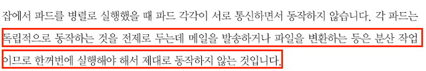

# 6. 컨트롤러 
> 파드들을 관리하는 역할

## 1) 레플리케이션 컨트롤러 
- 가장 기본적인 컨트롤러 
- 지정한 숫자만큼의 파드가 항상 클러스터 안에서 실행되도록 관리 

---

## 2) 레플리카 세트
- 레플리케이션 컨트롤러의 발전형 
- 레플리케이션 컨트롤러와 같은 동작을 함

### 차이점 
- 집합 기반의 셀렉터를 지원 
  - 레플리케이션 컨트롤러는 셀렉터가 `equality(=)` 기반이어서 레이블 선택 시 같은지 다른지만 확인
  - 집합 기반의 셀렉터는 `in`, `notin`, `exists`와 같은 연산자를 지원
- `kubectl`에서 `rolling-update` 옵션 사용 불가
  - 레플리케이션 컨트롤러는 사용 가능 
  - 레플리카 세트는 디플로이먼트를 사용해야 함 

### 설정 

- `.spec.template.metadata.labels`의 하위 필드 설정과 `.spec.selector.matchLabels`의 하위 필드 설정이 같아야 함.

### 레플리카 세트와 파드의 연관 관계
- 레플리카 세트와 파드는 느슨하게 결합되어 있음
  - 파드는 레이블 기준으로 관리되기 때문
  - 파드의 이름을 보고 레플리카 세트가 관리 대상으로 삼는다. (이름이 매칭되어야 관리 대상임)
    - 이로 인해 실행 중인 파드의 `metadata.labels.app`의 값을 변경하면 레플리카 세트가 관리하지 않게 된다.
    - 이 방법은 실행 중인 파드를 재시작하지 않고 실제 서비스에서 분리해 디버깅하는 용도 등으로 다양하게 활용 가능하다.

- DESIRED: 레플리카세트 설정에 지정한 파드의 개수 
- CURRENT: 레플리카세트를 이용해 현재 클러스터에서 동작하는 실제 파드 개수  

---

## 3) 디플로이먼트 
- 쿠버네티스에서 상태가 없는 앱을 배포할 때 사용하는 가장 기본적인 컨트롤러 
  - 기본적인 앱 배포에 사용됨 
- 레플리카세트를 관리 → 앱 배포를 더 세밀하게 관리 
  - 파드 개수 유지, 앱 배포 시 롤링 업데이터, 앱 배포 중 멈췄다가 다시 배포, 배포 후 이전 버전으로 롤백
- 디플로이먼트의 설정을 변경하면
  - 새로운 레플리카 세트가 생성되고, 그에 맞게 파드가 변경됨

### 상태 
- Progressing
- Complete
- Failed

---

## 4) 데몬 세트 

- 클러스터 전체 노드에 특정 파드를 실행할 때 사용하는 컨트롤러 
  - 새롭게 노드가 추가되었을 때, 데몬세트가 자동으로 해당 노드에 파드를 실행시킴 
  - 노드가 클러스터에서 빠졌을 때, 해당 노드에 있던 파드는 그대로 사라짐 
- 로그 수집기, 모니터링용 데몬 등 클러스터 전체에 항상 실행시켜두어야 하는 파드에 사용 

---

## 5) 스테이트풀 세트
- 레플리케이션 컨트롤러, 레플리카세트, 디플로이먼트는 "상태가 없는 파드들을 관리"하는 용도
- 스테이트풀 세트는 "상태가 있는 파드들을 관리"하는 컨트롤러임 
- 볼륨을 사용해서 특정 데이터를 저장 → 파드를 재시작해도 해당 데이터를 유지 
- 기본 동작 : 순서대로 실행하고 역순으로 제거
  - 병렬로 실행 & 종료 하기도 가능 

---

## 6) 잡 
- 실행된 후 종료해야 하는 성격의 작업을 실행시킬 때 사용하는 컨트롤러 
  - 특정 개수만큼의 파드를 정상적으로 실행 종료함을 보장함 
- 잡 → 파드 하나 실행 → 파드가 정상 종료 되었는지 확인 
  - 파드 실행 실패, 하드웨어 장애 발생, 노드 재시작 등의 문제가 발생할 경우 재시작 
- 잡 하나가 파드 여러 개를 실행할 수도 있음 

### 종류 
- 단일 잡
  - 파드 하나만 실행 
  - 파드가 정상적으로 실행 종료되면 잡 실행을 완료 
- 완료된 잡의 개수가 있는 병렬 잡 
  - 설정된 값이 1일 경우, 정상적으로 실행 종료된 파드가 1개만 생겨도 잡이 완료됨 
- 워크 큐가 있는 병렬 잡 
  - 파드 각각이 정상적으로 실행 종료 됐는지를 독립적으로 결정 
    - 대기열에 있는 작업들이 모두 동시에 실행될 수도 있다는 뜻
  - 파드 하나라도 정상적으로 실행 종료될 경우 새로운 파드가 실행되지 않음 
  - 최소한 파드 1개가 정상적으로 종료된 후 모든 파드가 실행 종료되면, 잡이 정상 종료됨 
  - 파드 1개가 정상적으로 실행 종료되면 다른 파드는 더 이상 동작하지 않거나 어떠한 작업 처리 결과를 내지 않음. 다른 파드는 모두 종료 과정 실행 

### 잡 패턴

-> 이거 대체 무슨말인가요..?

- 잡에서 파드를 병렬로 실행했을 때, 파드 각각이 서로 통신하면서 동작하지 않음 
  - 각 파드는 독립적으로 동작하는 것을 전제로 둔다 
- 잡의 일반적인 사용 패턴
  - 작업마다 잡을 하나씩 생성하기 보다는 모든 작업을 관리하는 잡 하나를 사용할 것
    - 잡 생성 오버헤드가 크기 때문
    - 작업이 많아질수록 잡 하나가 여러 개 작업을 처리하는게 좋음 
  - 작업 개수만큼의 파드를 생성하기 보다는 파드 하나가 여러 개의 작업을 처리하게 할 것 
    - 파드 생성도 오버헤드가 크다
  - 워크 큐를 사용한다면 카프카, RabbitMQ와 같은 큐 서비스로 워크 큐를 구현하도록 할 것 

---

## 7) 크론잡
- 잡을 시간 기준으로 관리하도록 생성함 
- 지정한 시간에 한 번만 잡을 실행하거나 지정한 시간동안 주기적으로 잡을 반복 실행