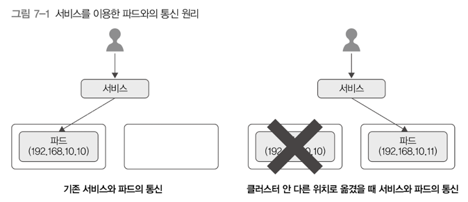
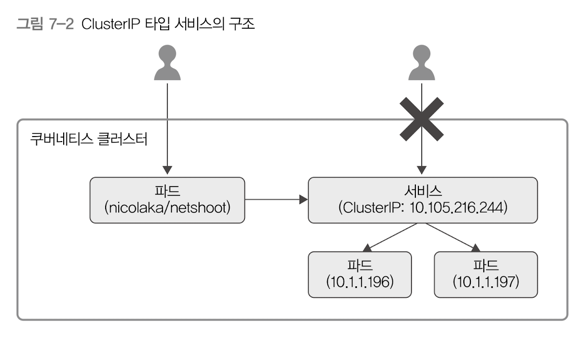
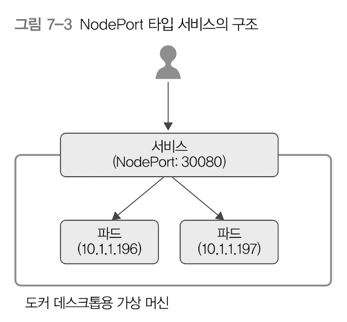
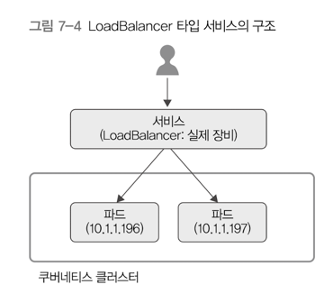
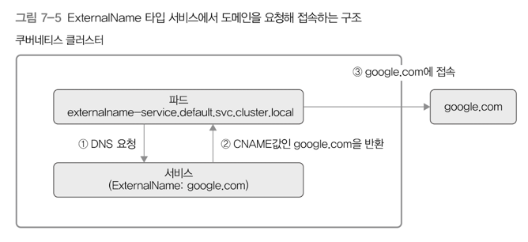
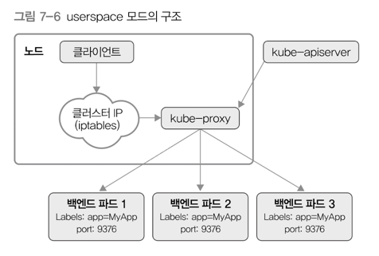
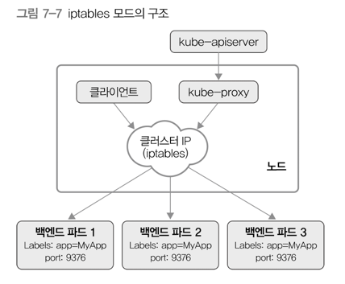
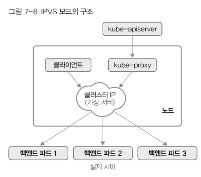

# 7. 서비스
> 여러 개 파드에 접근할 수 있는 IP 하나를 제공 
> - 본질적으로 로드밸런서 역할

## 1) 개념

- 파드는 컨트롤러가 관리 → 한 군데에서 고정되어 실행되지 않음 → 클러스터 내부를 옮겨 다님 
  - 노드를 옮기면서 실행되기도, 클러스터 안 파드의 IP가 변경되기도 함 
- 서비스란, **동적으로 변하는 파드들에 고정적으로 접근할 때 사용**하는 방법
- 파드가 클러스터 안 어디에 있든 고정 아이피를 통해 접근 가능
- 서비스는 L4 영역에서 통신할 때 사용 (Transport)
  - 인그레스는 L7 영역에서 통신할 때 사용 (Application)
  - https://shlee0882.tistory.com/110
- 파드가 클러스터 안 다른 위치로 옮겨져 IP가 변하더라도, 서비스가 자동으로 새로 위치를 옮겨 실행한 파드와 계속 통신 → 실제 접속자는 서비스만 이용해서 문제 없이 위치를 옮긴 파드 사용 가능

---

## 2) 서비스 타입
### ClusterIP

- 기본 서비스 타입 
- 쿠버네티스 클러스터 내부에서만 사용 가능
- **클러스터 내부**의 노드나 파드에서는 이를 이용해서 서비스에 연결된 파드에 접근 
- 클러스터 외부에서는 이용 불가 

### NodePort

- 서비스 하나에 모든 노드의 지정된 포트 할당 
  - ex: node1:8080, node2:8080 → 노드에 상관없이 서비스에 지정된 포트 번호만 사용하면 파드에 접근 가능
  - 파드가 node1에만 실행돼있고, node2에는 실행되지 않았더라도 node2:8080으로 접근하면 node1에 실행된 파드로 연결 
- 노드의 포트를 사용하기 때문에, 클러스터 외부에서도 접근 가능 
- 클러스터 외부에서 클러스터 내부의 파드로 접근할 때 사용할 수 있는 가장 간단한 방법 

### LoadBalancer

- 쿠버네티스를 지원하는 로드밸런서 장비에서 사용 
- 클라우드에서 제공하는 로드밸런서와 파드를 연결 → 해당 로드밸런서의 IP를 이용해 클러스터 외부에서 파드에 접근 가능하도록 해줌 

### ExternalName

- 서비스를 `.spec.externalName` 필드에 설정한 값과 연결
- 클러스터 내부에서 외부로 접근할 때 주로 사용

---

## 3) 헤드리스 서비스
https://www.youtube.com/watch?v=If03sN4isO4&t=400s
https://interp.blog/k8s-headless-service-why/
- 왜쓰는데?
  - 보통 Service 의 역할은, Service 로 들어온 요청을 여러 개의 Pod 중 하나 에만 전달하는 것이다. 하지만 이 요청이 모든 Pod 에 전달되어야 하는 경우에는 적합하지 않다.
  - 위의 설명대로라면, Cluster IP 를 없앤 Service 의 경우 DNS Server 가 모든 Pod 들의 A 레코드를 직접 알려주는 (resolving) 것이다. 요청을 수신받을 Cluster IP 가 없으니, 머리가 없는 Service 라고 부를 수 있겠다.
  - podIP 목록을 조회 → pod를 그룹으로 관리가 필요할 때 사용 (master/slave, 클러스터 등) 

- 클러스터 IP가 없는 서비스 
- 로드밸런싱이나 단일 서비스 IP가 필요 없을 때 사용 
- 셀렉터(`.spec.selector`) 필드를 설정하면 쿠버네티스 API로 확인 가능한 엔드포인트가 만들어짐 
  - 셀렉터 조건에 맞는 파드들의 IP:PORT가 엔드포인트로 등록되는 것 
  - 서비스와 연결된 파드를 직접 가리키는 DNS A 레코드도 만들어짐
  - 셀렉터가 없으면 엔드포인트가 만들어지지 않음 
  - 셀렉터가 없더라도 DNS 시스템은 ExternalName 타입의 서비스에서 사용할 CNAME 레코드가 만들어짐

---

## 4) kube-proxy
- 쿠버네티스에서 서비스를 만들었을 때 클러스터 IP나 노드 포트로 접근할 수 있게 만들어 실제 조작을 하는 컴포넌트
- 쿠버네티스 클러스터의 노드마다 실행 → 클러스터 내부 IP로 연결하려는 요청을 적절한 파드로 전달

### userspace 모드 

- 클라이언트 → 서비스의 클러스터 IP → 요청 → iptables → kube-proxy → 연결되어야 하는 파드로 연결해줌
- kube-proxy가 직접 클라이언트의 트래픽을 받아냄 
- 요청을 파드들에 나눠줄 때 라운드 로빈 방식 사용 
- 파드 하나로의 연결 요청이 실패할 경우 자동으로 다른 파드에 연결을 재시도 

### iptables 모드

- kube-proxy는 iptables를 관리하는 역할만 수행함 
- 직접 클라이언트에서 트래픽을 받지 않음 
- 클라이언트의 모든 요청은 iptables를 거쳐서 파드로 직접 전달됨 
- userspace 모드보다 요청 처리 성능이 좋음 
- 파드 하나로의 연결 요청이 실패하면 재시도하지 않고 그냥 요청이 실패함 
  - 컨테이너에 readinessProbe가 설정되었고, 그에 따른 헬스 체크가 정상적으로 되어야 연결 요청이 이루어지는 방식

### IPVS 모드

- IPVS: IP Virtual Server
- 리눅스 커널에 존재하는 L4 로드밸런싱 기술
  - 리눅스 커널 안 네트워크 관련 프레임워크인 넷필터(Netfilter)에 포함되어 있음 
  - IPVS 커널 모듈이 노드에 설치되어야 함 
- kernel space에서 동작 & 데이터 구조를 해시 테이블로 저장
  - iptables 모드보다 빠르고 좋은 성능 
- 많은 로드밸런싱 알고리즘 
  - round-robin(rr): 프로세스 사이에 우선순위를 두지 않고, 순서와 시간 단위로 CPU를 할당 
  - least connection(lc): 접속 개수가 가장 적은 서버를 선택
  - destination hashing(dh): 목적지 IP 주소로 해시값을 계산해 분산할 실제 서버 선택 
  - source hashing(sh): 출발지 IP 주소로 해시값을 계산해 분산할 실제 서버 선택 
  - shortest expected delay(sed): 응답 속도가 가장 빠른 서버를 선택 
  - never queue(nq): sed와 비슷하지만, 활성 접속 개수가 0인 서버를 가장 먼저 선택 