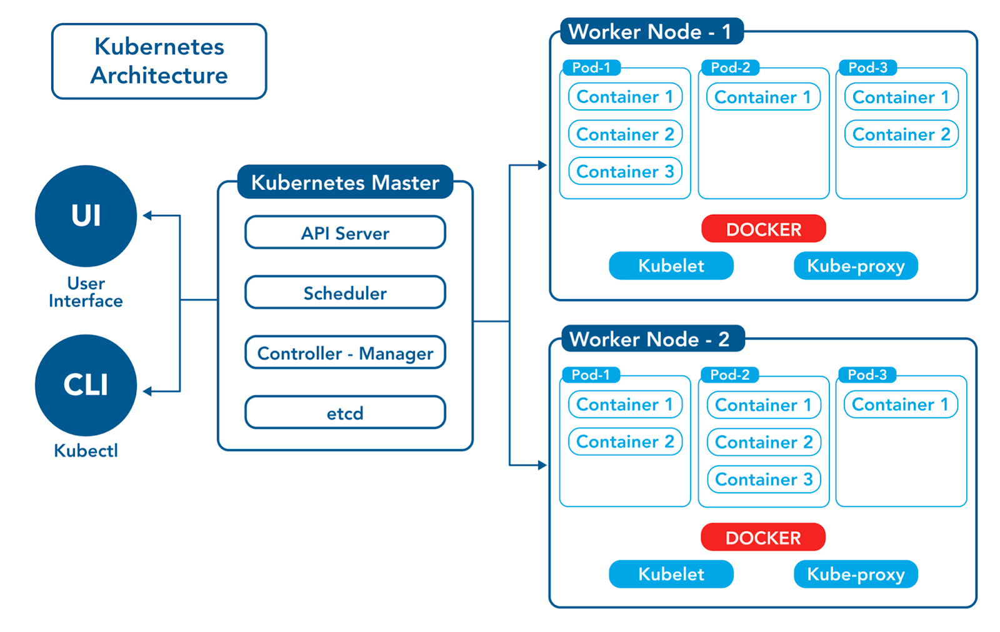
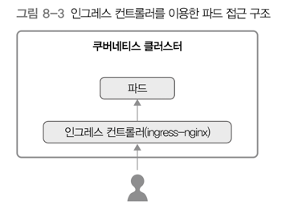
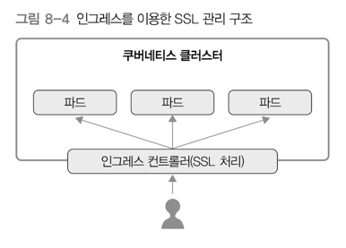
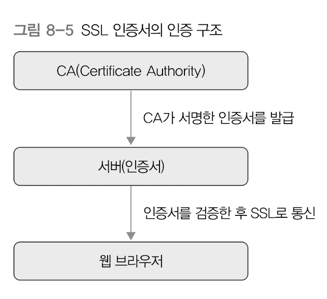
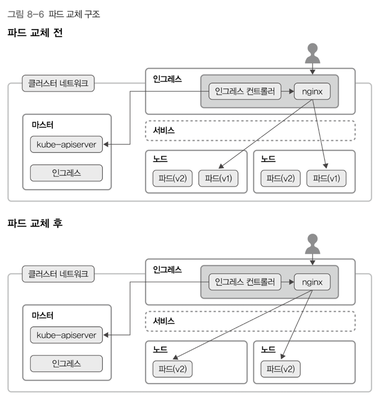
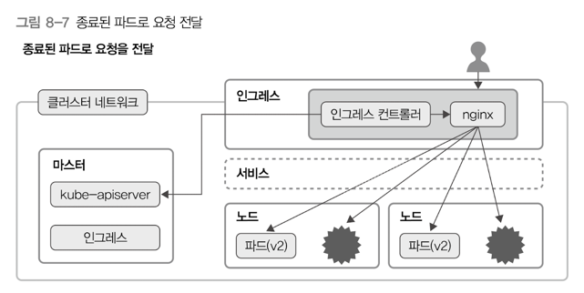

# 8. 인그레스 
> 클러스터 외부에서 안에 있는 파드에 접근할 때 사용하는 방법 
> - 서비스와의 차이점: 주로 L7 영역의 통신을 담당해서 처리한다는 것



## 1) 인그레스 개념 
- 클러스터 외부에서 내부로 접근하는 요청들을 어떻게 처리할지에 대해 정의해둔 규칙 모음
- 인그레스 자체는 아래와 같은 규칙들을 정의해 둔 자원 
  - 클러스터 외부에서 접근해야 할 URL 사용할 수 있게 함  
  - 트래픽 로드밸런싱
  - SSL 인증서 처리 
  - 도메인 기반 가상 호스팅 제공
- **이러한 규칙들을 실제로 동작시키는 것은 인그레스 컨트롤러**
- ingress-nginx 
  - 인그레스에 설정한 내용을 nginx 환경 설정으로 변경해서 nginx에 적용 

```text
Rules:
Host           Path    Backends
----           ----    --------
foo.bar.com
              /foos1   s1:80 (<none))
              /bars2   s2:80 (<none))
bar.foo.com
              s2:80 (<none))
```

## 2) ingress-nginx 컨트롤러 
- 인그레스 컨트롤러: 인그레스에 설정된 내용대로 동작하는 실제 주체
  - 쿠버네티스가 공식 제공하는 컨트롤러 
    - ingress-gce, ingress-nginx
- 인그레스 컨트롤러 자체도 쿠버네티스 클러스터 위에서 동작 → 해당 컨트롤러에 접근하기 위해 서비스 필요
  - 네트워크 옵션을 호스트 모드로 설정하면 별도의 NodePort 타입 서비스 없이도 인그레스 컨트롤러에 접근 가능 ???
  - 

---

## 3) 인그레스 SSL 설정 

- 인그레스를 이용하여, 요청으로 들어오는 트래픽에 다양한 설정 가능 
  - 인그레스로 SSL을 설정하면, 파드 각각에 SSL을 설정할 필요가 없음
  - 

---

## 4) 무중단 배포를 할 때 주의사항 


### 아래의 값을 적절히 설정 
- `maxSurge`: 디플로이먼트에 설정된 기본 파드 개수에 여분의 파드를 몇 개 더 추가할 수 있는지를 설정 
- `maxUnavailable`: 디플로이먼트를 업데이트하는 동안 몇 개의 파드를 이용할 수 없어도 되는지 설정

### 파드가 readinessProbe를 지원하는지 확인 
- 실제로 컨테이너가 서비스 요청을 처리할 준비가 되었는지 진단 → OK 상태여야 해당 파드와 연결된 서비스에 파드의 IP가 추가되고 트래픽을 받을 수 있음 
  - 자바 프로세스를 실행했을 때는 초기화 과정이 길다. 
  - livenessProbe의 진단 결과가 OK더라도 readinessProbe를 따로 지원하지 않으면 응답을 제대로 하지 못할 수 있음 
  - 따라서 readinessProbe를 지원해야 함 

### 쿠버네티스와 컨테이너 안에 그레이스풀 종료 설정
- kubelet은 새 파드가 실행되고 이전 파드를 종료할 때, 파드에 SIGTERM 신호를 먼저 보냄 
  - 일정 시간동안 그레이스풀 종료가 되지 않으면 강제로 SIGKILL 신호를 보내 파드 종료 
- 무중단 배포를 위해서는 컨테이너가 SIGTERM 신호를 받았을 때, 기존에 받은 요청만 처리를 완료하고 새 요청을 받지 않는 그레이스풀 종료가 설정되어 있어야 함
- 그레이스풀 종료가 설정되어있지 않다면...
  - 
  - 파드 1쪽으로 보내진 요청들이 에러가 발생함 
- 그레이스풀 대신 "프리스톱 훅(prestop hook)"
  - 쿠버네티스에서는 파드 생명주기 중 hook을 설정할 수 있음 
  - poststart hook: 파드 실행 직후 실행 
  - prestop hook: 파드 종료 직전에 실행 
    - 파드에 SIGTERM 신호를 보내기 전 실행 → 그레이스풀 종료와 같은 효과 
    - 프리스톱 훅 실행이 완료되기 전까지는 컨테이너에 SIGTERM 신호를 보내지 않음 