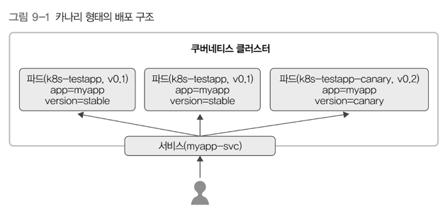

# 9. 레이블과 애너테이션 
> 쿠버네티스에서 자원들의 메타데이터를 관리하는 데 사용 
> - 레이블: 셀렉터와 함께 특정 레이블이 있는 자원들을 선택할 때 주로 사용
>   - 클러스터 안에서 사용자가 오브젝트를 생성할 때 해당 오브젝트를 구분하는 용도 
>   - 사용자가 임의로 원하는 값을 지정해서 사용 
> - 애너테이션: 주석 성격의 메타데이터를 기록하는 데 사용
>   - 사용자가 원하는 값을 설정하기보다 쿠버네티스 시스템에서 필요한 정보들을 표시하는 데 사용 

## 1) 레이블 
- 키-값 쌍으로 구성됨 
  - 키: 쿠버네티스 안에서 컨트롤러들이 파드를 관리할 때, 자신이 관리해야 할 파드를 구분하는 역할
- 클러스터 안에 오브젝트를 만들 때 메타데이터로 설정 가능
- 쿠버네티스는 레이블만으로 관리 대상을 구분  
  - 노드에도 레이블 설정 가능 → 클러스터 내 노드들을 레이블로 구분한 다음, 특정 레이블이 있는 노드에만 자원을 할당해 실행하는 것도 가능 

### 규칙
- 63글자 이하
- 시작과 끝 문자는 알파벳 대소문자 및 숫자(`[a-z0-9A-Z]`)
- 중간에는 대시(`-`), 밑줄(`_`), 점(`.`), 숫자 등이 올 수 있음
- `/`로 구분해서 접두어 사용 가능
  - DNS 하위 도메인 형식
  - 점(`.`)으로 구분 
  - 253글자 이하 
  - 접두어가 있는 레이블의 키는 보통 쿠버네티스 시스템에서 사용하는 레이블들 (`kubernetes.io/`)

### Label selector
- `equality-based(같은지, 다른지)`, `set-based(속하는지, 속하지 않는지)` 

---

## 2) 애너테이션
- 키-값 쌍으로 구성 
  - 키: 쿠버네티스 시스템이 인식할 수 있는 값을 사용
- 사용자가 설정할 수 있음 
- 쿠버네티스 시스템이 필요한 정보들을 담았음 
- 쿠버네티스 클라이언트나 라이브러리가 자원을 관리하는 데 활용
- 인그레스에서 필요한 설정들을 애너테이션으로 정의 가능 
  - ingress-nginx와 같은 인그레스 컨트롤러 → 애너테이션으로 사용자가 직접 nginx에 필요한 설정들을 정의 
- 사용자에게 필요한 정보들을 메모하는 용도
  - 릴리즈 정보, 로깅, 모니터링 정보 등등 

---

## 3) 레이블을 이용한 카나리 배포 
- 롤링 배포: 배포된 전체 파드를 일정 개수씩 교체하면서 배포 
- 블루/그린: 기존에 실행된 파드 개수와 같은 개수의 신규 파드를 모두 실행 → 신규 파드가 정상적으로 실행됐는지 확인 → 트래픽을 한번에 신규 파드로 이동 
- 카나리: 기존 버전을 유지한 채로 일부 버전만 신규 파드로 교체 → 버그, 이상 탐지 & 사용자 반응 확인 
- 쿠버네티스 기본 디플로이먼트는 파드를 모두 교체하는 방식. → 롤링, 블루/그린 지원 
  - 카나리 배포는 약간 어려움이 있으나, 레이블을 이용하면 가능함 

