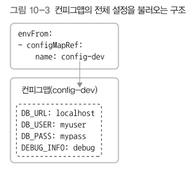

# 10. 컨피그맵 
> 컨테이너에 필요한 환경 설정을 컨테이너와 분리해서 제공하는 기능 
> - 다른 설정으로 컨테이너를 실행해야 할 때 사용 
> - 컨피그맵을 분리하면 컨테이너 하나를 개발용, 스테이지용, 상용 서비스용으로 사용할 수 있음

## 1) 컨피그맵 
### 일부만 사용 

### 전체 사용 

### 볼륨에 불러와서 사용 
- 컨피그맵 설정을 환경 변수로 설정하는 것이 아닌, 컨테이너의 볼륨 형식으로 컨피그맵을 설정해서 파일로 컨테이너에 제공
  

- 설정한 디렉터리에 필드 이름 형태의 파일로 저장됨 
