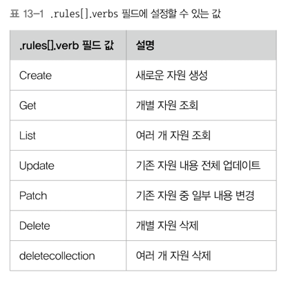
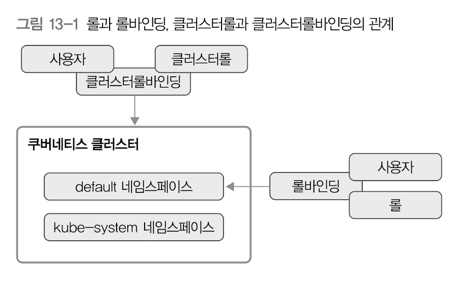

# 13. 인증과 권한 관리 
> - 인증: 쿠버네티스 클러스터에 접근할 때 허가받은 사용자인지 확인
> - 권한 관리: 인증받은 사용자에게 특정 자원의 사용 권한을 부여 

## 1) 인증 
- 사용자가 쿠버네티스 API에 접근하려면 인증 필요 
  - 기본 포트: 6443
  - TLS 인증 적용 
  - 즉, 6443 포트에 접근해 통신하기 위해서는 `kube-apiserver`에 있는 인증서와 클라이언트에 있는 인증서 사이의 검증을 통과해야 함 
  - 인증되지 않은 클라이언트는 외부에서 `kube-apiserver`에 접근할 수 없음 

- 일반적인 사용자 계정과 서비스 계정으로 인증 요청 
  - 일반적인 사용자 계정: 구글 계정... 등
  - 서비스 계정: 쿠버네티스가 직접 관리하는 사용자 계정 

### TLS 인증 정보 구조 
- TLS(Transport Layer Security)
  - 통신할 때 오가는 패킷 암호화 
  - 보통은 서버에만 인증서를 설정하면 보안 통신이 가능 
  - 클라이언트가 유효한지도 검증하는 기능이 있음 → `kube-apiserver`의 인증서와, 연결되는 클라이언트 인증서를 이용해 접속 

- `~/.kube/config`
  - `clusters`: 클러스터 관련 설정 
    - `cluster.insecure-skip-tls-verify`: true일 경우 인증서가 공인 기관의 인증서인지 검증하는 과정을 건너뜀. 공개 서버가 아니므로 공인 기관의 인증서가 필요하지 않음.
    - `cluster.server`: 외부에서 쿠버네티스 API에 접속할 주소 설정 
    - `name`: 클러스터의 이름을 설정
  - `contexts`: 사용자나 네임스페이스를 연결하는 설정 
    - `context.cluster`: 접근할 클러스터 설정
    - `context.user`: 클러스터에 접근할 사용자 그룹이 누구인지를 설정
    - `context.namespace`: config 파일에는 생략되었지만 default 네임스페이스가 아닌 특정 네임스페이스를 설정할 수 있음.
    - `name`: 컨텍스트의 이름 
  - `current-context`: `contexts` 필드가 여러개 있을 때 무엇을 선택해서 클러스터에 접근할지를 결정 
  - `users`: 클러스터를 사용할 사용자 그룹 명시 
    - `name`: 사용자 그룹의 이름 설정
    - `name.client-certificate-data`: 클라이언트 인증에 필요한 해시값을 설정
    - `name.client-key-data`: 클라이언트의 키 해시값을 설정

### 서비스 계정 토큰을 이용한 인증 
- TLS 인증이 아닌 서비스 계정을 사용하도록 변경 가능 

---

## 2) 권한 관리
- 인증 후, API를 사용할 권한이 있는지 확인되면 API를 사용할 수 있음 
- 쿠버네티스의 권한 관리 방법 
  - ABAC(Attribute-based access control): 속성 기반의 권한 관리 
    - 사용자, 그룹, 요청 경로, 요청 동사, 네임스페이스, 자원...
    - 권한 설정 내용을 파일로 관리 → 권한을 변경하려면 직접 마스터에 접속해서 파일을 변경한 후 `kube-apiserver` 컴포넌트를 재시작 → 관리하기 번거로움 
  - RBAC(Role-based access control): 역할 기반의 권한 관리 
    - 사용자와 역할을 별개로 선언 → 두 가지를 조합(binding) → 사용자에게 권한 부여 
    - 마스터에 접근할 필요 없음 
    - `kubectl`이나 API를 이용해서 관리할 수 있음 

### Role
- 특정 API나 자원 사용 권한들을 명시해둔 규칙의 집합 
- 일반 role: 해당 롤이 속한 네임스페이스에만 적용됨 
  - `apiGroups`: 롤이 사용할 API 그룹들
  - `resources`: 어떤 자원에 접근할 수 있는지를 명시
  - `resourceNames`: `resource`에 명시된 자원 중 특정 이름을 추가 
  - `verbs`: 어떤 동작을 할수있는지 설정
    - 

### ClusterRole
- 특정 네임스페이스 사용 권한이 아닌, 클러스터 전체 사용 권한을 관리 
  - 즉, 전체 네임스페이스에 적용 
- URL 형식으로 규칙 설정 가능 

### RoleBinding
- 롤과 사용자를 묶는 역할 
- 사용자가 어떤 롤을 사용하는지 설정 
- 롤바인딩: 특정 네임스페이스 하나에 적용
  - 일반 롤과 사용자를 묶음 
- 클러스터롤 바인딩: 클러스터 전체에 적용
  - 클러스터 롤과 사용자를 묶음

### 롤과 롤 바인딩, 클러스터롤과 클러스터롤 바인딩의 관계  

