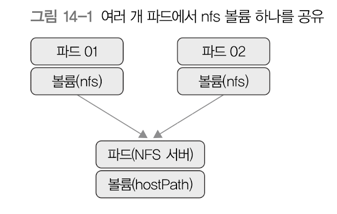

# 14. 데이터 저장 
> - 컨테이너 안에 저장한 데이터는 해당 컨테이너가 삭제됐을 때 모두 사라짐 
> - 컨테이너가 사라지더라도 데이터를 모두 보존할 수 있도록 컨테이너 외부에 데이터를 저장하는 방법 
> - 볼륨, 퍼시스턴트 볼륨 

## 1) 볼륨 
- 컨테이너는 기본적으로 상태가 없는 앱 컨테이너를 사용함 
  - 상태가 없기 때문에, 컨테이너에 문제가 생기거나 노드에 장애가 발생해서 컨테이너를 새로 실행해도 다른 노드로 자유롭게 옮길 수 있음 
  - 장점이지만, 현재까지 저장한 데이터가 사라진다는 단점이 되기도 함 
- 컨테이너에 문제가 생겨도 데이터를 보존해야 할 때 **볼륨을 사용**
- 볼륨을 사용하면 컨테이너를 재시작 하더라도 데이터를 유지
  - 볼륨, 퍼시스턴트 볼륨 

### 볼륨 공유
- `mountPropagation`
  - `None`: 호스트에서 볼륨에 해당하는 디렉터리의 하위에 마운트한 다른 마운트들은 볼 수 없음. 컨테이너가 만들어놓은 마운트를 호스트에서 볼 수도 없음.
  - `HostToContainer`: 해당 볼륨 하위에 마운트된 다른 디렉터리들도 해당 볼륨에서 볼 수 있도록 함 
  - `Bidirectional`: 하위에 마운트된 디렉터리 뿐만 아니라, 호스트 안 다른 모든 컨테이너나 파드에서 같은 볼륨을 사용할 수 있음

### emptyDir
- 파드가 실행되는 호스트의 디스크를 임시로 컨테이너에 볼륨으로 할당해서 사용 
- 파드가 사라질 경우 emptyDir에 할당해서 사용했던 볼륨의 데이터도 함께 사라짐 
- 메모리와 디스크를 함께 이용하는 대용량 데이터 계산에 주로 사용 
  - 연산이 오래걸리는 계산을 할 때 중간 데이터 저장용 
- 연산 중 컨테이너에 문제가 발생해서 재시작 되더라도 파드는 살아있음 → 저장된 데이터 계속 이용 가능 

### hostPath
- 파드가 실행된 호스트의 파일이나 디렉터리를 파드에 마운트
- emptyDir은 임시 디렉터리를, hostPath는 호스트에 있는 실제 파일이나 디렉터리를 마운트
- 컨테이너 뿐만 아니라 파드를 재시작했을 때도 호스트에 데이터가 남음
- 호스트의 중요 디렉터리를 컨테이너에 마운트해서 사용할 수 있음 
  - `/var/lib/docker`와 같은 도커 시스템용 디렉터리를 컨테이너에서 사용할 때
  - 시스템용 디렉터리를 마운트해서 시스템을 모니터링할 때 

### NFS(Network File System)

- 기존에 사용하는 NFS 서버를 이용해서 파드에 마운트 
- NFS 클라이언트 역할 
- 여러 개의 파드에서 볼륨 하나를 공유해 읽기/쓰기를 동시에 할 때도 사용 가능 
- 고성능 읽기/쓰기 작업에는 사용하기 어려움 
- 데이터의 안정성을 높인 간단한 파일 공유에 적합

---

## 2) 퍼시스턴트 볼륨과 퍼시스턴트 볼륨 클레임 
- PersistentVolume(PV)
  - 볼륨 자체를 의미 
  - 클러스터 안에서 자원으로 다룸 
  - 파드와는 별개로 관리되고, 별도의 생명주기가 있음 
- PersistentVolumeClaim(PVC)
  - 사용자가 PV에 하는 요청을 의미 
  - 사용하고자 하는 용량은 얼마인지, 읽기/쓰기는 어떤 모드로 설정하고 싶은지 등을 정해서 요청 
- 쿠버네티스는 볼륨을 파드에 직접 할당하는 방식이 아닌, 중간에 PVC를 두어 파드와 파드가 사용할 스토리지를 분리했음 
  - 다양한 스토리지를 PV로 사용할 수 있지만, 파드에 직접 연결하지 않고 PVC를 거쳐 사용하기 때문에 파드는 어떤 스토리지를 사용하는지 신경쓰지 않아도 됨 

### 생명 주기 

### 프로비저닝 
- PV를 만드는 단계 
  - static: PV를 미리 만들어두고 사용
    - 사용자의 요청이 있을 때 미리 만들어둔 PV를 할당
  - dynamic: 요청이 있을 때마다 PV 생성 
    - 사용자가 PVC를 거쳐서 PV를 요청했을 때 생성하여 제공 
    - PVC는 여러 가지 스토리지 중, 원하는 스토리지를 정의하는 StorageClass로 PV를 생성 

### 바인딩 
- 프로비저닝으로 만든 PV를 PVC와 연결하는 단계 
- PVC에서 원하는 스토리지 용량과 접근 방법을 명시해서 요청하면 그에 맞는 PV가 할당 됨 
- PVC에서 원하는 PV가 없는 경우 요청 실패 
  - 원하는 PV가 생길 때까지(반납 or 생성) 대기하다가 바인딩 
  - PV:PVC = 1:1

### 사용 
- PVC는 파드에 설정되고, 파드는 PVC를 볼륨으로 인식해서 사용함 
- 할당된 PVC는 파드를 유지하는 동안 계속 사용하며, 시스템에서 임의로 삭제할 수 없음 (사용 중인 스토리지 오브젝트 보호)

### 반환 
- 사용이 끝난 PVC는 삭제되고, PVC를 사용하던 PV는 초기화됨 → 이를 "반환(Reclaim)"이라고 함 

### 초기화 정책
- Retain
  - PV를 그대로 보존 
  - PVC가 삭제될 경우, 사용 중이던 PV는 released 상태이기 때문에 아직 다른 PVC가 재사용할 수 없음 
  - 단순한 사용 해제 상태 → PV 안의 데이터가 그대로 남아있음 
  - 재사용 방법 
    - PV삭제(외부 스토리지와 연결됐을 경우 외부 스토리지의 볼륨은 그대로 남아있음)
    - 스토리지에 남은 데이터 직접 정리 
    - 남은 스토리지의 볼륨을 삭제하거나 재사용하려면 해당 볼륨을 이용하는 PV를 재생성 

- Delete
  - PV를 삭제하고, 연결된 외부 스토리지 쪽의 볼륨도 삭제 
  - 프로비저닝 시, 동적 볼륨 할당으로 생성된 PV들은 기본적인 반환 정책이 Delete

- Recycle
  - PV의 데이터들을 삭제하고, 다시 새로운 PVC에서 PV를 사용할 수 있도록 함 
  - Deprecated
