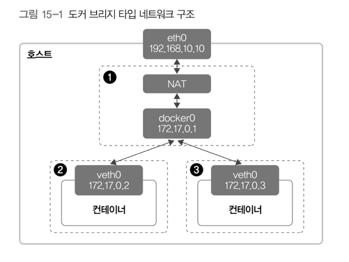
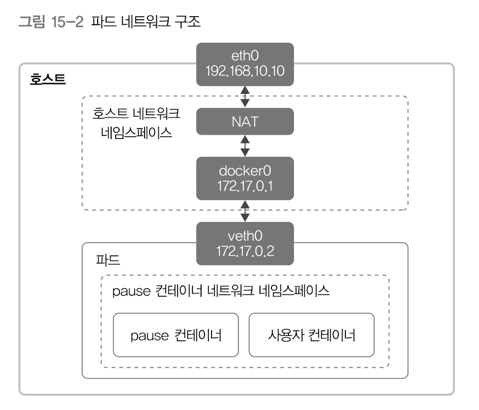
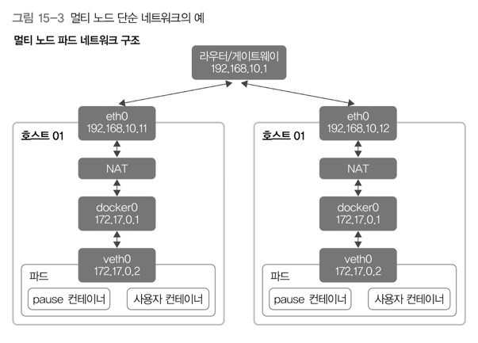
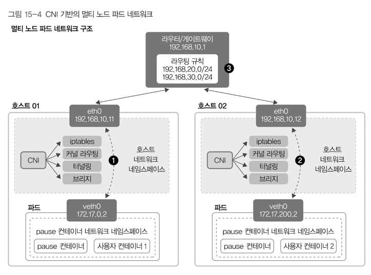
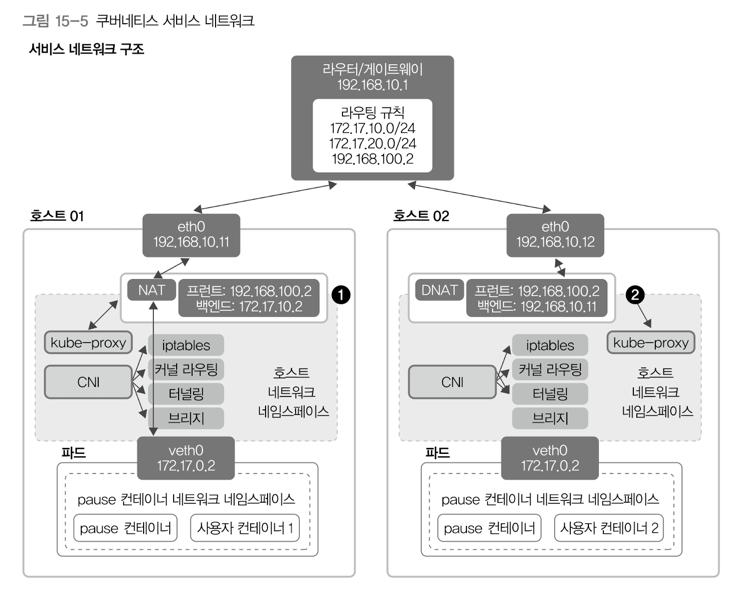

# 15. 클러스터 네트워킹 구성 
## 1) 파드 네트워킹
- 파드마다 IP 각각 할당 
- 여러 대 노드를 사용 → 클러스터 구성 → 노드별로 실행한 파드들이 IP를 이용해 서로 통신 
  - 이 때, 파드 각각은 컨테이너 하나가 아닌 여러 개의 컨테이너로 구성 

### 도커 컨테이너의 네트워킹 

- 도커 브리지 타입 네트워크
  - 호스트 안에 `docker0`이라는 브리지를 추가 
  - 해당 브리지가 컨테이너와 호스트 사이를 연결 
  - 그림 상의 점선 → 네트워크 네임스페이스. 아래의 것들을 별도로 제공  
    - Address Resolution Protocol (IP → MAC)
    - 라우팅
    - iptables
  - 그림 상의 1번 박스 == 호스트 네트워크 네임스페이스 || 디폴트 네트워크 네임스페이스
    - 호스트의 기본 네트워크가 생성 및 관리되는 곳
  - 그림 상의 2,3번 박스 == 컨테이너 네트워크 네임스페이스 
    - 컨테이너를 생성할 때마다 만들어지고, 컨테이너마다 별도의 네트워크를 사용 

- 네트워크 네임스페이스는 서로 연결되기 전까지는 독립적으로 동작 
  - 도커는 이러한 독립적인 네트워크 네임스페이스들을 서로 연결시켜주기 위해 베스(Virtual ethernet, veth)라는 가상 장치를 사용 
  - 베스는 한쪽 끝은 컨테이너, 다른 한쪽 끝은 호스트의 브리지(docker0)를 연결함 → 호스트 네트워크와 컨테이너 네트워크 간 통신 
  - 도커 브리지 타입에서는 별다른 설정이 없는 경우 `172.17.0.1/24`사이의 IP 사용

- 도커 컨테이너 네트워킹(컨테이너와 호스트 간 연결해주는 네트워킹) 타입
  - 브리지 타입: 호스트에 브리지를 만들고, 컨테이너와 호스트베스를 이용하여 연결 
  - 오버레이 타입: 호스트가 여러 대 있을 때, 각 호스트에 있는 컨테이너 네트워크를 오버레이 네트워크(VXLAN)로 연결. (도커 스웜 기본 네트워크)
    - https://www.minzkn.com/moniwiki/wiki.php/VXLAN
  - 맥브이랜 타입: 이더넷 장치 하나에서 여러 개 가상 MAC 주소를 할당하는 기술 
    - 컨테이너에 MAC주소와 IP주소 할당 
    - 가상 네트워크 스위치를 사용하지 않기 때문에, 브리지 타입보다 10~20%정도 빠름 
  - 호스트 타입: 컨테이너 네트워크 네임스페이스 대신, 호스트의 네트워크 네임스페이스를 직접 사용 
    - 호스트의 IP 직접 사용 → 컨테이너 네트워크 서비스 포트를 호스트에서도 확인할 수 있음
  - 링크 타입: 컨테이너별로 네트워크 네임스페이스를 만들지 않고, 이미 생성되어져 있는 네트워크 네임스페이스에 컨테이너를 연결. (쿠버네티스 파드 네트워크의 기본)

### 단일 노드 내 파드 네트워킹

- 파드 하나에 속한 컨테이너들은 같은 IP를 가짐 
  - 파드에 속한 컨테이너들은 veth0 하나를 공유 
  - 도커 네트워크 타입 중, 링크 타입을 사용하여 구현 
- 파드의 veth0
  - 컨테이너 네트워크 네임스페이스에 속한 장치 
  - 파드 내 다른 컨테이너들은 해당 pause 컨테이너 네트워크 네임스페이스를 공유해 사용 
  - pause 컨테이너가 변하지 않으면 다른 컨테이너들은 재시작을 하더라도 veth0와 veth0에 할당된 IP를 사용 
- 같은 파드 내 컨테이너들은 로컬 IP주소인 `127.0.0.1`로 서로 통신 가능 
- 파드에 접근할 때는 파드의 IP를, 파드 안에서 컨테이너 간 구분은 Port를 이용 

### 여러대 노드에 나눠서 실행되는 파드 사이의 네트워킹 

- 호스트 각각의 IP는 서로 다름 
- 호스트 내부의 IP들은 두 호스트가 서로 같음 
- 이럴 경우, `172.17.0.2`라는 IP로 요청이 오면 호스트01과 호스트02 중 어떤 호스트에 있는 파드로 패킷이 가야되는지 결정할 수 없음.
  - 즉, 위의 그림은 **제대로 된 네트워크 구성이 아님**

- 위 구성은 파드 IP가 호스트별로 다름(각각 다른 veth0의 IP) 
- 각각 다르게 할당된 파드 IP를 호스트의 인터페이스를 거쳐 다른 호스트로 보내고 받게 됨 
  - 호스트 네트워크 네임스페이스의 각종 기능들을 사용해야 함(iptables, 커널 라우팅, 터널링, 브리지)
  - 이러한 역할을 하는 것은 쿠버네티스는 **CNI(Container Network Interface)**라고 함 
- 그림상의 3번 
  - 특정 CNI가 커널 라우팅 기능과 동적 라우팅 기능으로 외부 라우터에 각 호스트 사이 라우팅을 정의해둔 것 
  - 외부 라우터를 사용할 경우, 기존 네트워킹 환경을 활용할 수 있음 
  - 컨테이너 라우팅까지 고려한 네트워크를 만들어야하기 때문에, 고려할 점이 더 늘어나는 단점도 존재 

---

## 2) 쿠버네티스 서비스 네트워킹 
- 실무에서는 보통 여러 개 파드를 실행하고, 해당 파드들의 앞에 쿠버네티스 서비스를 두고 사용 
- 실제 클러스터 내에서 통신할 때, 쿠버네티스 서비스의 IP를 거치도록 함
- 쿠버네티스는 파드용 CIDR(Classless Inter-Domain Routing)과 서비스용 CIDR을 별도로 지정 
  - [CIDR 이해해보기](https://inpa.tistory.com/entry/WEB-%F0%9F%8C%90-CIDR-%EC%9D%B4-%EB%AC%B4%EC%96%BC-%EB%A7%90%ED%95%98%EB%8A%94%EA%B1%B0%EC%95%BC-%E2%87%9B-%EA%B0%9C%EB%85%90-%EC%A0%95%EB%A6%AC-%EA%B3%84%EC%82%B0%EB%B2%95)
- 파드와 서비스는 서로 다른 IP 대역 사용 

### NodePort

- 쿠버네티스 서비스의 엔드포인트가 있는 호스트에 NAT 테이블 생성 
- 사용자가 지정한 서비스용 IP중의 하나를 파드의 IP와 연결 (kube-proxy가 담당)
- NAT 영역의 설정은 kube-proxy가 담당 
  - kube-proxy가 kube-apiserver를 지켜보다가 파드에 변경사항이 발생하면, 설정된 서비스 각각에 해당하는 NAT 규칙 업데이트