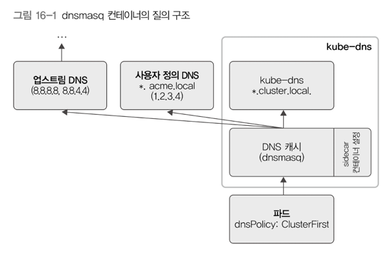

# 16. 쿠버네티스 DNS
## 1) 쿠버네티스 DNS
- 클러스터 안에서만 사용하는 DNS 설정 가능 
  - 파드 간 통신 시 IP가 아닌 도메인을 사용할 수 있음  
- 클라이언트나 API 게이트웨이가 호출할 서비스를 찾는 서비스 디스커버리 용도로 사용 가능

---

## 2) DNS 질의 구조 
- DNS 또한 쿠버네티스 클러스터 안에서 파드로 실행하는 것 
- 파드마다 안에서 도메인 이름을 어떤 순서로 질의할지 설정할 수 있음 
  - `Default`: 파드가 실행 중인 노드의 DNS 설정을 불러와서 사용 
  - `ClusterFirst`: 클러스터 안 도메인 형식과 일치하지 않는 도메인을 사용할 경우, 클러스터 외부 DNS인 upstream DNS에 도메인명 질의
  - `ClusterFirstWithHostNet`: 파드를 호스트 모드로 사용하겠다고 설정하는 hostNetwork 옵션. 파드 실행 시 반드시 사용해야 하는 필드값
  - `None`: 파드가 쿠버네티스 클러스터 안 DNS 설정을 무시함

### kube-dns 질의 구조

- kube-dns 파드: kubedns, dnsmasq, sidecar 3개의 컨테이너로 구성 
- kubedns 컨테이너: 쿠버네티스 바스터를 바라보다가, 서비스나 엔드포인트에 변경 사항이 있을 경우, 메모리에 저장 중인 DNS 데이터를 변경함 
- sidecar 컨테이너: kubedns와 dnsmasq 컨테이너에 헬스 체크 실행 

### CoreDNS의 질의 구조 
- 파드 안에 coredns 컨테이너 하나만 존재 
- 플러그인으로 새로운 기능 추가 가능 
- CoreFile이라는 자체 설정 파일 형식에 맞춰 DNS 설정 
- `.:53`의 하위 항목은 해당 서버의 DNS zone 정보 
  - 맨 앞의 `.`은 해당 도메인의 root 영역을 뜻함
  - `53`은 포트 정보를 뜻함. DNS의 기본 포트가 53

  
> 파드 안에 DNS를 직접 설정할 수도 있음 