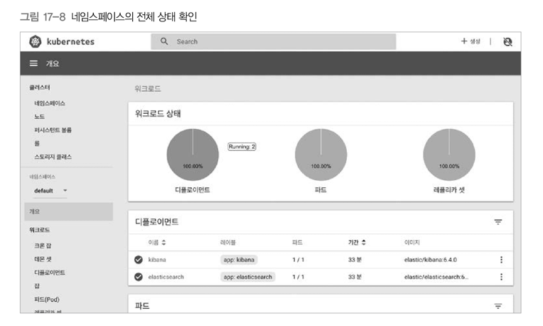
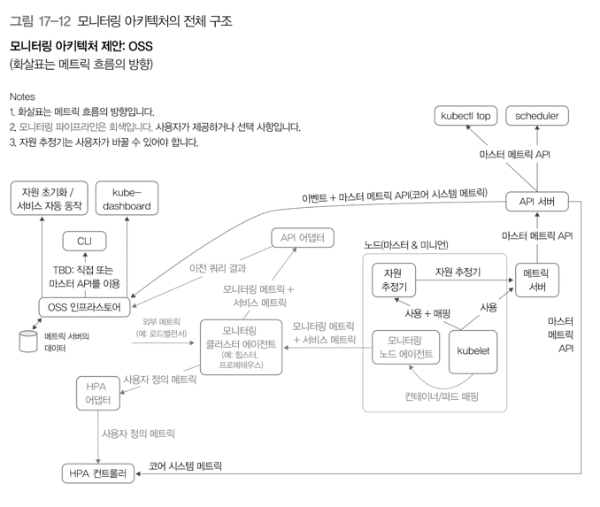
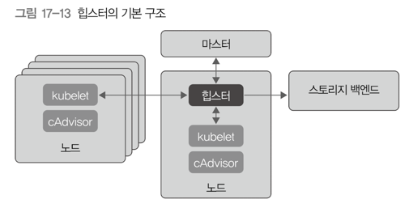
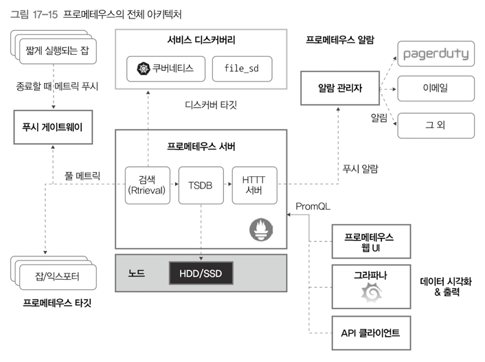

# 17. 로깅과 모니터링 
## 1) 로깅
- 컨테이너 오케스트레이터를 사용하는 환경에서 로그 수집 시 주의해야 할 것 
  - 특별한 상황을 제외하고는 로그를 로컬 디스크에 파일로 저장하지 않아야 함 
  - 컨테이너는 상황에 따라 클러스터 안 여러 노드를 옮겨 다니기 때문 
  - 특정 앱 컨테이너의 로그를 확인하기 위해서는 전체 클러스터의 노드 중, 어떤 노드에 해당 컨테이너가 실행되었는지 확인해야 함 

### 파드 로그 확인 
- `kubectl logs -f {파드이름}` 명령을 사용해서 파드의 로그 확인 가능 
  - `-f` 옵션은 실행 중인 로그를 지속해서 수집하는 테일링(tailing)을 실행하는 옵션임  

### Elasticsearch로 로그를 수집한 후 모아보기 
- 로그를 모아 살펴보도록 하는 오픈 소스 도구
  - kafka, fluentd, logstash, elasticsearch, kibana...
  - 대표적인 조합?
    - Elasticsearch: 로그 저장
    - Kibana: 로그 조회(Elasticsearch 전용 대시보드 UI) 
- Elasticsearch 
  - 클러스터 형태로 여러 대의 노드에서 실행하도록 개발한 검색 엔진 시스템 
  - Kibana라는 대시보드 UI를 이용해서 시각화할 수 있음 

### 클러스터 레벨 로깅 
- 컨테이너가 비정상 종료되거나, 노드에 장에가 있더라도 앱 컨테이너의 로그를 확인할 수 있어야 함 
  - 따라서, 컨테이너, 파드, 노드의 생명 주기와 분리된 스토리지를 구축해야 함 
- 클러스터 레벨 로깅: 생명주기와 분리된 스토리지를 구축하는 아키텍처를 의미 

#### 컨테이너 로그
- 컨테이너 로그 수집은 컨테이너 런타임(보통은 도커를 사용)이 담당 
- 앱 컨테이너 → `stdout`, `stderr`이라는 표준 스트림으로 로그 출력 → 컨테이너 런타임이 표준 스트림 2개를 특정 로그 드라이버로 리다이렉트 
- 기본으로 `json-file`사용
  - 이외 로그 드라이버: `syslog`, `journal`...
- `docker inspect {컨테이너ID}`
  - `LogPath`: `/var/lib/docker/containers/{컨테이너ID}/{컨테이너ID}-json.log`
    - 컨테이너 관련 메타 데이터들을 저장한 심볼릭 링크
  - `kublet`은 위 로그 파일에 대해 다음 심볼릭 링크들을 생성하고 로그를 관리
    - `/var/log/containers/{파드이름}_{파드 네임스페이스이름}_{컨테이너이름}{컨테이너ID}.log`
    - `/var/log/pods/{파드UID}/{컨테이너이름}/0.log`
- fluentd와 같은 로그 수집기는 위 심볼링 링크들을 테일링 → 로그 내용 수집 → 파일 이름으로부터 필요한 메타데이터(파드, 컨테이너, 네임스페이스) 정보를 얻음 
- 로그가 노드 스토리지를 과도하게 사용하는 문제가 발생할 경우
  - 도커 런타임에서 로그 로테이트 관련 설정을 확인
  - `ps -ef | grep dockerd`명령 실행 
  - `--log-opt max-size`, `--log-opt max-file` 설정값을 확인 → 필요 시 조정 

#### 시스템 컴포넌트 로그 
- 쿠버네티스의 시스템 구성요소 중 일부는 컨테이너 기반으로 동작하지 않음
  - `kublet`, `docker` 등
- `systemd`: `systemd-journald`로 로그를 관리 
  - 그렇지 않은 상황에서는 `/var/log/` 디렉터리에 로그 남김 → 노드에 로그로테이트 관련 설정 필수

### fluentd를 이용한 로그 수집 
- `fluentd`를 이용하여 쿠버네티스에서 발생한 로그를 Elasticsearch에 저장 
- `fluentd`
  - 쿠버네티스와 같은 CNCF 재단에서 관리하는 범용 로그 수집용 오픈소스 프로젝트 
- `fluentd` → `Daemonset`으로 설정하여 클러스터 모두에 실행 → 로그 수집 → `Elasticsearch`에 저장 → `Kibana`로 조회
  - `Kibana`사용 시, `Elasticsearch`의 특정 인덱스들 데이터를 조회하는 index pattern을 만들어야 함 
  - 주로 날짜 별 인덱스를 조회하는 인덱스 패턴을 주로 사용 
  - 날짜 단위로 로그를 저장할 경우, 로그가 많을 때 오래된 날짜의 인덱스만 삭제해서 디스크 용량을 확보 

### 스턴을 이용한 실시간 로그 모니터링 
- 스턴(stern)
  - 실시간 로그 모니터링 도구
  - 셸에서 바로 여러 개 파드의 로그를 실시간으로 볼 수 있음 
  - 서비스 개발을 진행하는 중, 파드 상태를 확인할 때 유용함 

---

## 2) 쿠버네티스 대시보드 
- `kubectl`
  - 커맨드라인 인터페이스
  - 클러스터 관리, 파드 생성/삭제/업데이트 가능 
- 쿠버네티스 대시보드
  - 웹 UI 기반 
  - 

---

## 3) 쿠버네티스 클러스터 모니터링
### 1 - 쿠버네티스 모니터링 아키텍처
- 쿠버네티스 모니터링: System metrics, Service metrics를 수집해서 확인
- Core metric pipeline: 쿠버네티스 구성요소들을 직접 관리 
- Monitoring pipeline: 클러스터 사용자들에게 필요한 정보를 모니터링 

#### 시스템 메트릭 
- 노드나 컨테이너의 CPU, 메모리 사용량 같은 시스템 관련 메트릭 
- Core metric, Non-core metric으로 나뉨 
- Core metric
  - 쿠버네티스 내부 컴포넌트들이 사용하는 메트릭 
  - 클러스터 안이나 내장 오토스케일링에서 사용할 수 있는 자원이 얼마인지 파악 
  - `kubectl top`과 같은 명령에서 보여주는 CPU/메모리 사용량, 파드/컨테이너의 디스크 사용량 등이 코어 메트릭 값에 속함
- Non-core metric
  - 쿠버네티스가 직접 사용하지 않는 다른 시스템 메트릭을 뜻함 

#### 서비스 메트릭 
- 애플리케이션을 모니터링할 때 필요한 메트릭 
- 쿠버네티스 인프라용 컨테이너에서 수집하는 메트릭, 사용자 애플리케이션에서 수집하는 메트릭으로 나뉨
- 쿠버네티스 인프라용 컨테이너에서 수집하는 메트릭
  - 클러스터를 관리할 때 참고해서 사용 가능 
- 사용자 애플리케이션에서 수집하는 메트릭
  - 웹 서버의 응답 시간 관련 값이나, HTTP 500 error가 몇 건이나 나타났는지 등에 대한 서비스 관련 정보 
  - Horizontal Pod Autoscaling에서 사용자 정의 메트릭으로 사용 가능 

#### 코어 메트릭 파이프라인 
- 쿠버네티스 관련 구성 요소를 직접 관리 
- 코어 시스템 메트릭 수집 → 핵심 요소를 모니터링 
- `kubelet`, 메트릭 서버, 메트릭 API 등으로 구성되어 있음 
- 여기서 제공하는 메트릭 → 시스템 컴포넌트에서 사용 
- 스케줄러나 HPA 등에서 작업할 때의 기초 자료로 활용 
- 별도의 외부 서드파티 모니터링 시스템과 연계하지 않고 독립적으로 운영 
- `kubelet`에 내장된 `cAdvisor`
  - 노드/파드/컨테이너의 사용량 정보 수집 
  - 메트릭 서버 → 해당 정보를 `kubelet`에서 불러와 메모리에 저장 → 마스터의 메트릭 API를 이용해 다른 시스템 컴포넌트가 조회 가능 
  - 메모리에 보관하므로 짧은 기간의 정보만 보관

#### 모니터링 파이프라인 
- 기본 메트릭 포함, 여러 가지 메트릭을 수집 
- 클러스터 사용자에게 필요한 모니터링에 사용 
- 쿠버네티스는 모니터링 파이프라인을 직접 관리하지 않음 
- 시스템 메트릭, 서비스 메트릭 모두 수집 가능 
- 코어 메트릭 파이프라인과 분리되어 있으므로, 원하는 모니터링 도구 사용 가능
- 추천(?) 조합
  - cAdvisor + 힙스터 + 인플럭스DB
  - **cAdvisor + 프로메테우스**
  - cAdvisor + collectd + 힙스터
  - snapd + 힙스터
  - snapd + SNAP cluster-level agent
  - Sysdig
- 힙스터는 사용을 권하지 않음 

#### 모니터링 아키텍처 

### 2 - 힙스터 

- 힙스터 대신 메트릭 서버 사용 권장 
- 추가로 더 자세한 모니터링이 필요할 경우 프로메테우스와 같은 전문 모니터링 도구 이용 권장 
- 특징 
  - 힙스터는 쿠버네티스에서 파드로 실행됨 
  - `kube-apiserver`와 통신해서 전체 클러스터의 노드와 파드 현황 목록을 불러옴 → 모니터링에 필요한 데이터들을 수집 (`cAdvisor` 이용) → 인플럭스 DB와 같은 별도의 스토리지 백엔드에 저장   
  - 인플럭스 DB에 저장된 데이터를 조회할 때는 대시보드 도구인 `Grafana`를 많이 사용함 

### 3 - 메트릭 서버 
- 쿠버네티스 모니터링 아키텍처에서 코어 메트릭 파이프라인을 효율적으로 사용하기 위해 힙스터 대신 모니터링 표준으로 도입한 것 
- 힙스터의 간소화 버전 
- `kubelet`으로 수집해 메모리에 저장한 파드나 노드의 메트릭 데이터를 `kube-apiserver`로 조회하는 Metrics API를 제공 
- 쿠버네티스의 핵심 데이터들 대부분은 `etcd`에 저장되나, 메트릭 데이터까지 `etcd`에 저장하면 부하가 너무 커지기 때문에 메모리에 저장하는 것 
- 보관 주기를 길게 가져가기 위해서는 별도의 외부 스토리지 필요

### 4 - 프로메테우스 
- SoundCloud에서 개발 → CNCF 재단에서 관리

#### 주요 기능 
- time series(시계열) 데이터를 저장할 수 있는 다차원 데이터 모델
- 데이터 모델을 효과적으로 활용할 수 있는 `PromQL`이라는 쿼리 언어 제공 
- 기본적인 모니터링 데이터 수집
  - 프로메테우스 서버가 수집하려는 대상에서 데이터를 가져오는 풀(pull) 구조 
- 수집 대상은 정적으로, 혹은 서비스 디스커버리를 이용해 동적으로 설정 가능 
- 외부에서 직접 푸시한 모니터링 데이터를 푸시 게이트웨이로 받아서 저장 가능 
- 모니터링 데이터는 단순히 디스크에 저장하며, 필요 시 외부 스토리지에 저장 
- 내장 웹 UI, 혹은 그라파나를 이용해 시각화

#### 프로메테우스 아키텍처 

- 프로메테우스 서버 
  - 시계열 데이터를 수집하여 저장
- 클라이언트 라이브러리 
  - 애플리케이션을 개발할 때, 프로메테우스에서 데이터를 수집하도록 만드는 라이브러리 
- 푸시 게이트웨이 
  - 클라이언트에서 직접 프로메테우스로 데이터를 보낼 때 받는 역할 
- 익스포터
  - 프로메테우스 클라이언트 라이브러리를 내장해 만들지 않은 애플리케이션에서 데이터 수집 
  - 거의 모든 애플리케이션에서 데이터를 수집할 수 있음 (100개가 넘는 다양한 익스포터 존재)
- 알람 관리자
  - 알람을 보낼 때 중복 처리, 그룹화 등을 하여 알람을 어디로 보낼지를 관리 

