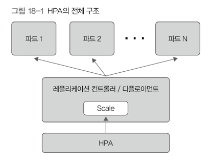

# 18. 오토스케일링 
> - 클라우드 컴퓨팅의 유용한 기능 중 하나 
> - 수평적 파드 오토스케일러(Horizontal Pod Autoscaler, HPA)라는 기본 오토스케일링 기능 제공
> - HPA는 CPU 사용률을 기반으로 디플로이먼트를 이용해 실행된 파드 개수를 늘리거나 줄여줌 

## 1) HPA 구조 

- HPA가 디플로이먼트에 속한 파드들의 상태를 모니터링 → 지정된 조건에 이르면 디플로이먼트를 scale → 파드 개수를 늘리거나 줄임 
- 실행할 때마다 지정된 자원의 사용량을 쿠버네티스 API로 확인 → 설정된 HPA 조건에 맞을 때 오토스케일링 수행 
- 기본값 30초 → 30초마다 확인 
- 오토스케일링 기준 식 
  - `대상 파드 개수 = (현재 파드의 CPU 사용률을 모두 더한 값 / 목표 CPU 사용률)을 올림한 값`
  - ex: 목표 CPU 사용률이 60이고, 파드 2개의 CPU 사용률이 각각 50, 80인 경우
    - 130 / 60 = 2.17 → 올림하면 3
    - 대상 파드 개수가 3이므로, 기존 파드 개수 2개에 추가적으로 1개의 파드를 더 실행 
    - 즉, 목표 CPU 사용률은 파드 당 CPU 사용률임 
- 오토스케일링할 때 기준인 자원 사용량은 **현재 시점의 데이터만 사용**
  - 파드가 늘어나는 중에 다시 파드를 늘리라고 요청 할수도 있음 → 오토스케일링 수행 후 일정 시간동안은 추가로 수행하지 않도록 대기시간 설정 가능
  - 늘어날 때 기본 대기시간 3분, 줄어들 때 기본 대기시간 5분 
