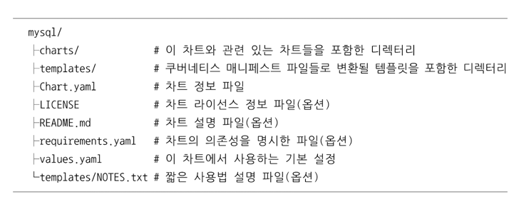

# 헬름
> 쿠버네티스의 템플릿들을 모아 관리하는 패키지 매니저 도구 

## 1) 헬름 
- 헬름이란?  
  - 차트를 관리하는 쿠버네티스 패키지 매니저 도구
  - 차트: 템플릿 파일들의 집합
- 차트와 차트 압축 파일(`tgz`)을 만들 수 있음 
- 차트가 저장된 차트 저장소와 연결해 쿠버네티스 클러스터에 차트를 설치하거나 삭제할 수 있음 
- 헬름 차트들의 배포 주기 관리 가능 
- 헬름을 이용하면 잘 정리된 차트들을 이용하여 필요한 애플리케이션을 빠르게 설치할 수 있음 
  - Helm Charts라는 깃허브 저장소에는 다음의 차트가 준비돼있음 
    - MySQL, Redis, Jenkins, Hadoop, Elasticsearch ... 

### 주요 개념 
- 차트: 쿠버네티스에서 실행할 애플리케이션을 만드는 데 필요한 정보 묶음
- 컨피그: 패키지한 차트에 넣어서 배포 가능한 오브젝트를 만들 때 사용할 수 있는 설정 
- 릴리즈: 특정 컨피그를 이용해 실행 중인 차트의 인스턴스 

---

## 2) 헬름 클라이언트와 틸러 서버 
- 헬름은 아래와 같이 구성돼있음 
  - 헬름 클라이언트: 커맨드라인 인터페이스
    - Go 언어로 개발 
    - 틸러 서버와는 gRPC로 통신 
  - 틸러(Tiler) 서버: 쿠버네티스 클러스터 안에서 헬름 클라이언트의 명령을 받아 쿠버네티스 API와 통신

- 헬름 클라이언트를 사용하면 로컬 서버에서 차트를 만들고 차트 저장소들을 관리할 수 있음 
- 틸러 서버와 통신하면 쿠버네티스 클러스터에 설치하려는 차트를 보낼 수 있음 
- 현재 클러스터에 실행 중인 (헬름 차트를 통해 실행한)애플리케이션 릴리즈 정보를 요청하거나, 실행 중인 릴리즈를 업그레이드하거나 삭제하는 요청 등을 틸러 서버로 보냄
- 틸러 서버는 주로 헬름 클라이언트의 요청을 처리하기 위해 대기 
  - 요청이 올 경우, 클러스터에 실행할 릴리즈를 만들기 위해 차트의 설정을 조합하거나, 클러스터에 차트를 설치하거나, 릴리즈를 관리 
  - 클러스터에서 실제로 차트를 업그레이드 하거나 삭제할 수도 있음 

---

## 3) 헬름 차트 구조
- 차트는 디렉터리 하나에 포함된 파일들의 집합 
- 디렉터리 이름을 차트 이름으로 지정하고, 그 안에 필요한 파일들을 넣음
  - 대략 아래와 같은 구조
  - 
- 보통은 잘 만들어진 차트를 바로 가져와서 사용하지만, 수정해서 사용 할수도 있음 

---
 
## 4) 헬름 차트 저장소 만들어 사용하기 
- 헬름 차트 저장소를 직접 운영할 수 있음(사내에서 사용할 때와 같이 private해야할 경우)
- 차트 뮤지엄(ChartMuseum)이라는 오픈 소스 차트 저장소 이용 

